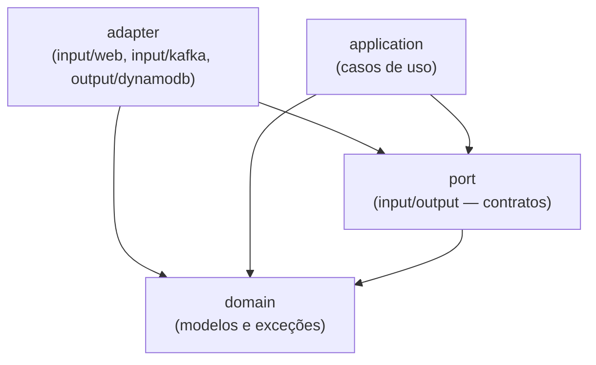
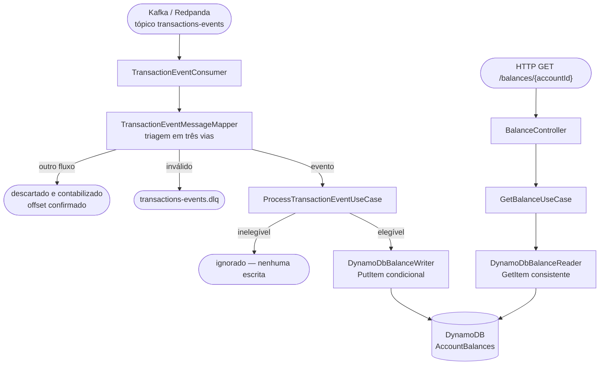

# core-balance-service

[](../../actions/workflows/build.yml)
[](../../actions/workflows/test.yml)
[](../../actions/workflows/docker.yml)
[](../../actions/workflows/codeql.yml)

> ## Instruções para o candidato
>
> Este repositório é um **template utilizado em processo seletivo de vaga para Engenheiro(a) de Software**. Ele **não** é o desafio em si — é o ponto de partida.
>
> Para participar do processo:
>
> 1. Clique no botão verde **"Use this template"** no topo desta página e em **"Create a new repository"** para criar o seu próprio repositório a partir deste template (não faça um fork). Marque a opção **"Include all branches"** para trazer todas as branches disponíveis.
> 2. Escolha a branch com a stack de sua preferência — `kotlin` ou `java`. Após criar o repositório, clone-o e rode `git checkout <branch-escolhida>` (ex.: `git checkout kotlin`). Para evitar confusão, considere apagar a outra branch e definir a escolhida como padrão em Settings → Branches.
> 3. Mantenha o repositório criado **público** — o time responsável pelo processo seletivo precisa conseguir acessá-lo para avaliar a sua solução.
> 4. Implemente a solução de acordo com a **especificação enviada a você** pelo time responsável pelo processo seletivo.
> 5. Utilize a arquitetura, os padrões e a infraestrutura já configurados aqui como base — sinta-se à vontade para estendê-los conforme a especificação exigir.
> 6. Ao finalizar, siga as instruções de entrega informadas junto com a especificação recebida.
>
> O restante deste documento descreve o que já está pronto no template (stack, arquitetura, infraestrutura local e comandos disponíveis).

## Sumário

- [Stack](#stack)
- [Arquitetura](#arquitetura)
- [Estrutura de pastas](#estrutura-de-pastas)
- [Endpoints da API](#endpoints-da-api)
- [Mensageria Kafka](#mensageria-kafka)
- [Imagens Docker utilizadas](#imagens-docker-utilizadas)
- [Variáveis de ambiente](#variáveis-de-ambiente)
- [Como rodar](#como-rodar)
- [Comandos do Makefile](#comandos-do-makefile)
- [Testes](#testes)
- [Cobertura de testes](#cobertura-de-testes)
- [Decisões arquiteturais](#decisões-arquiteturais)

## Stack

| Categoria | Tecnologia |
|-|-|
| Linguagem | Kotlin 2.3.21 |
| Runtime | Java 21 (Eclipse Temurin) |
| Framework | Spring Boot 4.1.0 (Spring Framework 7) |
| Build | Gradle 9.5.1 (Kotlin DSL) |
| Web | Spring MVC (`spring-boot-starter-webmvc`) |
| Serialização JSON | Jackson 3 (`tools.jackson`, incluindo módulo Kotlin) |
| Banco de dados | Amazon DynamoDB (via AWS SDK for Java v2) |
| Mensageria | Kafka (protocolo) via Spring Kafka, broker real = Redpanda |
| Testes | JUnit 5, Konsist (testes de arquitetura), MockMvc |
| Cobertura | JaCoCo (gate mínimo de 90% de instruções) |
| Containers | Docker + Docker Compose |

## Arquitetura

O projeto segue **arquitetura hexagonal**: o núcleo do negócio (domínio) não depende de nenhum framework, banco de dados ou broker de mensagens. Toda comunicação com o mundo externo passa por **portas** (interfaces) implementadas por **adaptadores**. A regra de dependência é sempre unidirecional, em direção ao domínio.



*As setas indicam "depende de" — sempre apontando em direção ao domínio.*

Essa regra é validada automaticamente por um **teste de arquitetura** (`HexagonalArchitectureTest`, usando a lib [Konsist](https://github.com/LemonAppDev/konsist)), que quebra o build caso alguma camada viole a direção de dependência esperada — por exemplo, se `domain` importar algo do Spring, ou se `application` importar um `adapter` diretamente.

### Camadas

#### 1. `domain` — núcleo do negócio

Modelos, invariantes e a decisão de elegibilidade. Não importa Spring, AWS SDK, Kafka nem Jackson — restrição verificada por teste.

- `domain/model/Money.kt` — quantia exata com moeda. Deliberadamente **sem** construtor `Double` e **sem** `plus`/`minus`: a primeira ausência torna a violação de precisão impossível de escrever, a segunda torna impossível derivar saldo por aritmética.
- `domain/model/EventTimestamp.kt` — o marcador de frescor, em microssegundos desde a época Unix.
- `domain/model/Balance.kt` — o estado corrente de uma conta: quantia, moeda, instante e transação de origem.
- `domain/model/TransactionEvent.kt` — o agregado de ingestão. Único lugar que julga elegibilidade (`APPROVED` **e** `ENABLED`) e único que converte evento em saldo, copiando `account.balance` **literalmente**.
- `domain/eligibility/`, `domain/outcome/` — a decisão de elegibilidade e a classificação do desfecho do processamento.

#### 2. `port` — contratos do hexágono

- **Input**: `ProcessTransactionEventUseCase` (ingestão), `GetBalanceUseCase` (consulta).
- **Output**: `BalanceWriter` (escrita condicional), `BalanceReader` (leitura consistente), `BalanceTelemetry` (a lista de coisas observáveis, revisável em um arquivo), `TransientProcessingException` (o vocabulário de falha que o writer oferece a qualquer chamador).

#### 3. `application` — casos de uso

- `ProcessTransactionEventService` — sequencia elegibilidade → escrita condicional → desfecho. **Não** decide elegibilidade (é do domínio) nem ordenação (é do banco). Um evento inelegível nunca chega ao writer: é assim que o marcador de frescor não avança.
- `GetBalanceService` — devolve o saldo persistido, ou lança `BalanceNotFoundException`. **Nunca** devolve `0.00` para conta desconhecida.

#### 4. `adapter` — integrações com o mundo externo

- **`adapter/input/web`** — `BalanceController` expõe `GET /balances/{accountId}`; `BalanceResponseMapper` renderiza dinheiro como texto e o instante em ISO-8601 local; `BalanceExceptionHandler` traduz exceções em status sem vazar detalhe interno; `CorrelationIdFilter` popula o MDC.
- **`adapter/input/kafka`** — `TransactionEventConsumer` recebe o payload como `String` (manter os bytes originais é o que permite publicar na DLQ sem reserialização); `TransactionEventMessageMapper` faz a triagem em três vias; `KafkaConsumerConfig` concentra ack mode, retry e DLQ.
- **`adapter/output/dynamodb`** — `DynamoDbBalanceWriter` executa a escrita condicional que sustenta toda a corretude; `DynamoDbBalanceReader` faz leitura fortemente consistente; `BalanceItemMapper` traduz o item.
- **`adapter/output/observability`** — `MicrometerBalanceTelemetry`, único lugar que conhece Micrometer.


### Fluxo de dados



Os dois caminhos não compartilham nenhuma linha de código — encontram-se apenas na tabela. É isso que torna barato separá-los em dois deployables quando houver motivo ([ADR-007](docs/adr/007-single-deployable-with-profile-split.md)).

## Estrutura de pastas

```
src/main/kotlin/br/com/itau/challenge/
├── Application.kt                          # bootstrap Spring Boot
└── balance/
    ├── domain/{model,eligibility,outcome,exception}/   # núcleo, sem framework
    ├── port/{input,output}/                            # contratos (interfaces)
    ├── application/                                    # casos de uso
    └── adapter/
        ├── input/web/{dto,mapper}/                     # REST
        ├── input/kafka/{config,dto,mapper,exception}/  # ingestão
        ├── output/dynamodb/                            # persistência
        └── output/observability/                       # métricas e logs

src/test/kotlin/                            # testes unitários e de arquitetura (sem infra externa)
src/integrationTest/kotlin/                 # testes de integração (infra real via Docker)

docs/adr/                                   # decisões arquiteturais registradas
specs/001-core-banking-balance/             # spec, plano, tasks e contratos

infra/                                       # seeds de infraestrutura local (Docker Compose)
├── dynamodb/                               # criação da tabela AccountBalances
└── redpanda/                               # config do cluster e criação dos tópicos

http/                                       # arquivos .http para chamar a API manualmente
```

## Endpoints da API

### `GET /balances/{accountId}`

Devolve o saldo corrente da conta: o snapshot autoritativo do evento elegível de **maior** `transaction.timestamp` já aplicado. O serviço é uma **projeção** de uma origem upstream, não um ledger — não calcula, não acumula e não reconcilia.

| Parâmetro | Onde | Obrigatório | Descrição |
|-|-|-|-|
| `accountId` | path | Sim | Não vazio, apenas `[A-Za-z0-9-]`. Validado **antes** de qualquer acesso ao armazenamento |
| `X-Correlation-Id` | header | Não | Se ausente, é gerado e devolvido na resposta |

**Sucesso:**
```
GET /balances/5b19c8b6-0cc4-4c72-a989-0c2ee15fa975
200 OK
{
  "id": "5b19c8b6-0cc4-4c72-a989-0c2ee15fa975",
  "owner": "315e3cfe-f4af-4cd2-b298-a449e614349a",
  "balance": { "amount": 183.12, "currency": "BRL" },
  "updated_at": "2025-07-05T18:04:13.433-03:00"
}
```

O corpo tem **exatamente estas quatro chaves**. `lastTransactionId` continua persistido e nos logs estruturados, mas não é exposto: uma chave a mais faria um cliente estrito rejeitar a resposta inteira.

`balance.amount` é **número JSON com exatamente duas casas**, serializado de `BigDecimal` — a escala sobrevive à serialização (`150.00` sai como `150.00`, nunca `150`) e o valor não transita por `Float`/`Double` em ponto algum do sistema. Na persistência ele continua sendo gravado como texto, porque o tipo `N` do DynamoDB removeria as casas decimais ([ADR-006](docs/adr/006-decimal-string-money-representation.md), emendada em 2026-09-07).

`owner` está **sempre presente**: `account.owner` é obrigatório na ingestão, então um evento sem titular vai para a DLQ e nenhum saldo sem titular chega a existir.

> **Conferindo `amount` na mão?** A ferramenta pode apagar as casas decimais. O serviço emite `150.00`; Postman, Insomnia, REST Client do VS Code e o DevTools do navegador rodam `JSON.parse`, que lê o literal num `double` de 64 bits — onde `150.00` e `150` são o mesmo valor — e exibem **`150`**. A perda é do visualizador, não do serviço. Para ver os bytes reais: `curl -s http://localhost:8080/balances/$ACC | od -c`, ou `| jq`, que preserva o literal. Só valores com zero à direita são afetados — `183.12` chega íntegro em qualquer cliente.

`updated_at` deriva de `transaction.timestamp` — descreve **quando a transação ocorreu na origem**, não quando o registro foi gravado. Renderizado com offset local (fuso configurável) e milissegundos por truncamento ([ADR-010](docs/adr/010-response-instant-rendering.md)).

**Erros:**

| Status | `code` | Quando |
|-|-|-|
| `400` | `INVALID_ACCOUNT_ID` | formato inválido — o armazenamento **não** é consultado |
| `404` | `BALANCE_NOT_FOUND` | a conta não possui estado corrente. O sistema **não** inventa `0.00`: afirmar zero para uma conta desconhecida afirmaria um fato financeiro que ele não conhece |
| `500` | `INTERNAL_ERROR` | corpo genérico; nenhuma mensagem de exceção, nome de tabela ou stack trace atravessa a fronteira |

Contrato completo em [`specs/001-core-banking-balance/contracts/balances-api.yaml`](specs/001-core-banking-balance/contracts/balances-api.yaml). Exemplos prontos em [`http/balances.http`](http/balances.http) (extensão REST Client do VS Code, cliente HTTP do IntelliJ, ou `make http`).

## Mensageria Kafka

### Tópico `transactions-events` (entrada)

`TransactionEventConsumer` consome eventos financeiros e persiste o saldo que cada um carrega. O tópico tem **3 partições**, e as mensagens são publicadas com **`account.id` como chave**.

**Schema da mensagem (JSON):**
```json
{
  "transaction": {
    "id": "8e8ae808-b154-48b5-9f3e-553935cc4543",
    "type": "CREDIT", "amount": 97.07, "currency": "BRL",
    "status": "APPROVED", "timestamp": 1751641364589998
  },
  "account": {
    "id": "5b19c8b6-0cc4-4c72-a989-0c2ee15fa975",
    "owner": "315e3cfe-f4af-4cd2-b298-a449e614349a",
    "created_at": 1634874339000000, "status": "ENABLED",
    "balance": { "amount": 183.12, "currency": "BRL" }
  }
}
```

**`account.balance` é o snapshot autoritativo**, persistido literalmente. `transaction.amount` é informativo e **nunca** é aplicado a um saldo anterior — um `DEBIT` de `30.00` sobre um saldo de `70.00` persiste `70.00`, não `40.00`.

Um evento só atualiza o saldo quando `transaction.status = APPROVED` **e** `account.status = ENABLED`. Status ausente ou desconhecido torna o evento **inelegível**, não a mensagem inválida.

Schema formal em [`contracts/transaction-event.schema.json`](specs/001-core-banking-balance/contracts/transaction-event.schema.json).

### Triagem de mensagens

Toda mensagem recebida termina em um de três lugares:

| Caso | Destino |
|-|-|
| Evento bem formado | processado; o offset é confirmado após o desfecho |
| Bloco `transaction` **integralmente ausente** (`{"account": {...}}`) | **descartado de forma observável**, contabilizado em `balance.events.unsupported`, offset confirmado. **Não vai para a DLQ** |
| JSON malformado, ou bloco `transaction` presente porém incompleto | **DLQ**, sem retry, com o payload original e o header nomeando o campo |

A segunda linha existe para que a DLQ continue significando "algo está quebrado". Se ela também acumular mensagens que o consumer simplesmente não deveria processar, todo alerta sobre ela vira ruído ([ADR-009](docs/adr/009-three-way-message-triage.md)).

### Tópico `transactions-events.dlq` (saída)

Recebe mensagem inválida e retry esgotado — e nada além disso. O valor publicado é o **payload original**, sem reserialização, com a chave preservada, e os headers `kafka_dlt-*` mais `x-failure-reason` e `x-correlation-id`. Formato em [`contracts/dlq-message.md`](specs/001-core-banking-balance/contracts/dlq-message.md).

### Ordenação, duplicidade e concorrência

Nenhuma das três é resolvida no código da aplicação. Todas são decididas por **uma expressão condicional avaliada pelo DynamoDB dentro da mesma operação atômica que escreve**:

```
attribute_not_exists(#pk) OR #lastEventTimestamp < :incomingTimestamp
```

Não existe janela entre avaliar e escrever, então nenhum entrelaçamento de threads, consumers ou instâncias pode produzir *lost update* — e por isso **não há um único lock em todo o código**, garantia verificada por teste ([ADR-004](docs/adr/004-conditional-put-with-return-values-on-failure.md)).

A chave da mensagem é **otimização de contenção, nunca argumento de corretude**: com ela a condição quase nunca reprova; sem ela reprova mais e o saldo persistido é idêntico.

**Como publicar mensagens de teste:**
- `make kafka-produce-transactions-events TOPIC=transactions-events COUNT=50` — eventos aleatórios, chaveados por conta, com timestamps embaralhados e status variados.
- `make kafka-produce-accounts-events TOPIC=transactions-events COUNT=10` — eventos de **outro fluxo**, úteis para observar o descarte da linha 5a.
- Pelo Redpanda Console (http://localhost:8081) → *Produce Message*.

## Imagens Docker utilizadas

| Serviço | Imagem | Finalidade |
|-|-|-|
| `app` | build local (`eclipse-temurin:21-jdk` → `eclipse-temurin:21-jre`) | a própria aplicação |
| `dynamodb` | `amazon/dynamodb-local:3.3.0` | DynamoDB local (modo in-memory) |
| `dynamodb-seed` | `amazon/aws-cli:2.36.8` | cria a tabela e popula os dados iniciais |
| `dynamodb-admin` | `aaronshaf/dynamodb-admin:5.3.4` | console web para inspecionar a tabela |
| `redpanda` | `docker.redpanda.com/redpandadata/redpanda:v26.1.14` | broker Kafka-compatível (modo KRaft, single-node) |
| `redpanda-seed` | `docker.redpanda.com/redpandadata/redpanda:v26.1.14` | aplica a config do cluster (`config.sh`), depois cria o tópico e publica mensagens iniciais (`seed.sh`), usando `rpk` |
| `redpanda-console` | `docker.redpanda.com/redpandadata/console:v3.9.0` | console web para inspecionar tópicos/mensagens |

> Todas as imagens usam versões fixas (nunca `latest`) para builds reprodutíveis.

> **Por que Redpanda em vez do Apache Kafka?** É um binário único em C++ (sem JVM, sem ZooKeeper), com startup quase instantâneo — mais leve para ambiente local, mantendo 100% de compatibilidade com o protocolo Kafka (a aplicação usa `spring-kafka` normalmente, sem nenhum código específico do Redpanda).

## Variáveis de ambiente

Todas têm valor padrão para desenvolvimento local (fora do Docker Compose) e são sobrescritas dentro do `docker-compose.yml` para apontar para os hostnames internos dos containers.

| Variável | Padrão (local) | Descrição |
|-|-|-|
| `DYNAMODB_ENDPOINT` | `http://localhost:8000` | endpoint do DynamoDB |
| `DYNAMODB_REGION` | `us-east-1` | região (fake, para o SDK) |
| `BALANCE_TABLE_NAME` | `AccountBalances` | tabela do DynamoDB |
| `KAFKA_BOOTSTRAP_SERVERS` | `localhost:19092` | broker Kafka/Redpanda |
| `KAFKA_CONSUMER_GROUP_ID` | `core-banking-balance-consumer` | group id do consumer |
| `KAFKA_CONSUMER_CONCURRENCY` | `3` | threads do listener — o teto útil é a contagem de partições |
| `TRANSACTIONS_TOPIC` | `transactions-events` | tópico consumido |
| `TRANSACTIONS_DLQ_TOPIC` | `transactions-events.dlq` | tópico de dead-letter |
| `BALANCE_API_TIMEZONE` | `America/Sao_Paulo` | fuso usado para renderizar `updated_at` |

## Como rodar

Pré-requisito único: **Docker** (com Docker Compose). O `make` já vem instalado por padrão em Linux e macOS; no Windows, use o **WSL2** (o Makefile depende de utilitários estilo Unix e não roda direto no PowerShell/cmd).

```bash
make up      # sobe tudo em background: app + DynamoDB + Redpanda (+ seeds + consoles)
make logs    # acompanha os logs da aplicação
curl "http://localhost:8080/balances/5b19c8b6-0cc4-4c72-a989-0c2ee15fa975"
make stop    # derruba tudo
```

Consoles web disponíveis depois de subir a stack:

| Console | URL |
|-|-|
| Aplicação | http://localhost:8080 |
| DynamoDB Admin | http://localhost:8001 |
| Redpanda Console | http://localhost:8081 |

### Loop de desenvolvimento rápido (rodando pela IDE)

Para iterar mais rápido durante o desenvolvimento — com debugger, breakpoints e sem reconstruir a imagem Docker a cada mudança — rode a aplicação direto pela IDE em vez de `make up`/`make run`:

```bash
make db-up        # só DynamoDB Local + console web
make kafka-up  # só Redpanda + console web
```

Esses comandos retornam assim que os containers **sobem**, não quando os jobs de seed **terminam** — espere alguns segundos (acompanhe com `make logs` ou pelos consoles web) antes de rodar a aplicação, senão ela pode consultar a tabela/tópico antes de estarem populados.

Depois rode `Application.kt` (ou `./gradlew bootRun`) direto pela IDE. Os valores padrão em `application.yaml` (`localhost:8000` para o DynamoDB, `localhost:19092` para o Redpanda) já apontam para essas portas — nenhuma variável de ambiente extra é necessária.

### Solução de problemas

- **Primeiro `make up` demorando:** na primeira execução o Docker baixa ~5 imagens (`dynamodb-local`, `aws-cli`, `redpanda`, `redpanda-console`, `dynamodb-admin`), então pode levar alguns minutos dependendo da sua internet. Acompanhe com `make logs` — se não houver progresso nenhum por vários minutos, aí sim algo está errado.
- **Erro `port is already allocated` / `address already in use`:** a stack ocupa as portas `8080` (app), `8000`/`8001` (DynamoDB), `8081` (Redpanda Console) e `9092`/`19092` (Redpanda). Libere a porta em conflito (encerrando o processo que a está usando) ou pare qualquer outra stack local que já esteja rodando.
- **Ficou algo travado/inconsistente:** `make clean-containers` remove todos os containers do projeto (rodando ou parados, incluindo órfãos) para você começar do zero.

## Comandos do Makefile

Execute `make help` a qualquer momento para ver esta lista no terminal.

### Aplicação

| Comando | Descrição |
|-|-|
| `make build` | constrói a imagem Docker de runtime da aplicação |
| `make run` | sobe a stack em primeiro plano (logs no terminal) |
| `make up` | sobe a stack em background |
| `make logs` | acompanha os logs da aplicação (`docker compose logs -f`) |
| `make stop` | derruba os containers da stack (`docker compose down`) |
| `make http` | chama os arquivos `.http` contra a app rodando (via container Node, sem dependência local) |

### DynamoDB

| Comando | Descrição |
|-|-|
| `make db-up` | sobe o DynamoDB Local + console web e cria a tabela `AccountBalances` |
| `make db-seed` | roda novamente o job de criação da tabela (idempotente). A tabela **não** é populada: um saldo só existe porque um evento elegível o criou |
| `make db-scan` | lista os saldos atualmente armazenados |
| `make db-down` | para o DynamoDB Local + console web |

### Kafka / Redpanda

> **Nota:** a criação automática de tópicos (`auto_create_topics_enabled`) fica desabilitada por `infra/redpanda/config.sh` logo que o cluster sobe (roda antes de `seed.sh`, no mesmo container `redpanda-seed`). Ou seja, tópicos precisam ser criados explicitamente — via `make kafka-topic-create` ou pelo próprio seed — antes de produzir/consumir mensagens.

| Comando | Descrição |
|-|-|
| `make kafka-up` | sobe o Redpanda + console web e cria os tópicos `transactions-events` e `transactions-events.dlq` (3 partições cada) |
| `make kafka-seed` | roda novamente o job de criação dos tópicos (idempotente). Nenhuma mensagem é publicada: use os alvos `kafka-produce-*` para gerar tráfego |
| `make kafka-topic-create NAME=meu-topico [PARTITIONS=3]` | cria um novo tópico no Redpanda com o nome e o número de partições informados (`PARTITIONS` é opcional, padrão `1`) |
| `make kafka-produce-accounts-events TOPIC=meu-topico [COUNT=50]` | produz eventos de teste no formato `{"account": {...}}` (id/owner UUID aleatórios, `created_at` aleatório nos últimos 10 minutos, `status` ENABLED/DISABLED aleatório) para o tópico informado (`COUNT` é opcional, padrão `100`) |
| `make kafka-produce-transactions-events TOPIC=meu-topico [COUNT=50]` | produz eventos de teste no formato `{"transaction": {...}, "account": {...}}` (id's UUID aleatórios, `type` CREDIT/DEBIT, `amount` aleatório de 0.01 a 10000, `status` APPROVED/DECLINED, `timestamp` aleatório nos últimos 10 minutos; `account.created_at` aleatório nos últimos 10 anos, `account.status` sempre ENABLED, `balance.amount` aleatório de 0.00 a 20000) para o tópico informado (`COUNT` é opcional, padrão `100`) |
| `make kafka-consume TOPIC=meu-topico` | imprime todas as mensagens atualmente no tópico informado (usa timeout de 5s, já que `rpk topic consume` não tem um modo "ler o que existe e sair") |
| `make kafka-down` | para o Redpanda + console web |

### Testes

| Comando | Descrição |
|-|-|
| `make test` | constrói a imagem de teste e roda `./gradlew check` (testes unitários + gate de cobertura ≥ 90%) dentro de um container — não precisa de nenhuma infra externa |
| `make integration-test` | sobe DynamoDB + Redpanda reais e roda `./gradlew integrationTest` contra eles |

### Limpeza

| Comando | Descrição |
|-|-|
| `make clean-containers` | remove **todos** os containers do projeto (rodando ou parados), incluindo órfãos de serviços renomeados/removidos |
| `make clean` | remove as imagens Docker construídas localmente |

## Testes

O projeto tem duas suítes de teste bem separadas:

### `src/test` — testes unitários (`./gradlew test`)
Não dependem de nenhuma infraestrutura externa — rodam em qualquer lugar, inclusive dentro do container Docker de teste (`make test`), sem Docker-in-Docker.

- Domínio, aplicação e adapters com **fakes** escritos à mão para os *ports* (nenhuma chamada real a DynamoDB ou Kafka).
- `BalanceControllerTest` usa `MockMvc` para o contrato REST; `BalanceResponseContractTest` compara a resposta com o próprio `balances-api.yaml`, para que código e contrato não divirjam em silêncio.
- `DynamoDbBalanceWriterTest` afirma a expressão condicional **literalmente**: é o único ponto do sistema onde a corretude vive numa string interpretada por outro processo, e trocar `<` por `<=` não quebraria nenhum outro teste.
- Três testes de arquitetura (Konsist) transformam princípios em build quebrado: `HexagonalArchitectureTest` (direção de dependências), `MonetaryPrecisionArchitectureTest` (nenhum `Double`/`Float` em produção) e `NoLockingArchitectureTest` (nenhum lock).

### `src/integrationTest` — testes de integração (`./gradlew integrationTest`)
Rodam contra infraestrutura **real**, subida via Docker Compose. Ficam propositalmente fora do `check`/`test` para não exigir infra no pipeline padrão.

- `DynamoDbBalanceIntegrationTest` — duplicidade, evento antigo e empate de timestamp exercidos contra um DynamoDB real, que é onde essas garantias de fato moram.
- `ConditionalWriteConcurrencyIntegrationTest` — **o mais importante do conjunto**: 32 threads liberadas por uma barreira escrevem a mesma conta, 20 vezes seguidas. A barreira não é cerimônia — sem ela as threads executam quase em série e o teste passa sem provar nada.
- `TransactionEventConsumerIntegrationTest` — o `@KafkaListener` de produção contra o broker real.
- `TransactionEventDlqIntegrationTest` — o que vai para a DLQ **e o que não vai**: um evento de outro fluxo não pode aparecer lá.
- `EndToEndBalanceFlowIntegrationTest` — fluxo completo: sequência embaralhada com duplicata, `DECLINED`, `DISABLED` e mensagem de outro fluxo, e a resposta REST refletindo o snapshot elegível mais recente.

Rode com `make integration-test` (sobe a infra necessária automaticamente antes de executar).

## Cobertura de testes

Configurado com **JaCoCo**, gate mínimo de **90% de cobertura de instruções**, que falha o build (`./gradlew check`) se não for atingido. Um resumo legível é impresso diretamente no output do Gradle (sem precisar abrir o relatório HTML), com contagem por tipo de métrica (instruções, branches, linhas, complexidade, métodos, classes) e o veredito do gate.

Relatório HTML completo em `build/reports/jacoco/test/html/index.html` após rodar `./gradlew test` ou `make test`.

## Decisões arquiteturais

As decisões com consequências duradouras estão registradas em [`docs/adr/`](docs/adr/), cada uma com contexto, decisão, justificativa, consequências e alternativas descartadas.

| ADR | Decisão |
|-|-|
| [001](docs/adr/001-conditional-write-for-idempotency.md) | Escrita condicional — **substituída pela 004**; mantida porque o raciocínio que registra continua valendo |
| [002](docs/adr/002-account-id-as-kafka-message-key.md) | `accountId` como chave da mensagem — otimização de contenção, nunca argumento de corretude |
| [003](docs/adr/003-strong-consistency-for-balance-reads.md) | Leitura fortemente consistente, sem cache |
| [004](docs/adr/004-conditional-put-with-return-values-on-failure.md) | `PutItem` condicional com `ReturnValuesOnConditionCheckFailure` — o núcleo de corretude |
| [005](docs/adr/005-single-retry-authority.md) | Uma única autoridade de retry; o SDK da AWS não retenta |
| [006](docs/adr/006-decimal-string-money-representation.md) | Dinheiro como texto decimal em toda fronteira |
| [007](docs/adr/007-single-deployable-with-profile-split.md) | Um deployable, com a separação desenhada mas não executada |
| [008](docs/adr/008-account-partition-key-design.md) | `ACCOUNT#{accountId}` como partition key |
| [009](docs/adr/009-three-way-message-triage.md) | Triagem em três vias — o que mantém a DLQ significando "algo quebrou" |
| [010](docs/adr/010-response-instant-rendering.md) | Renderização de `updated_at` por truncamento, com offset local |

A especificação, o plano de implementação, as tasks e os contratos vivem em [`specs/001-core-banking-balance/`](specs/001-core-banking-balance/).
