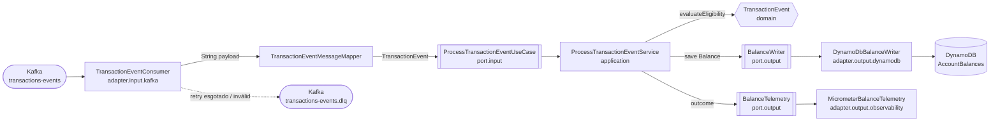
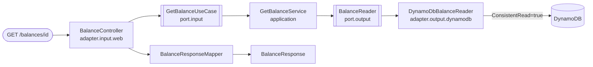

# Implementation Plan: Core Banking — Saldo Corrente por Eventos

**Branch**: `002-core-banking-balance` | **Date**: 2026-09-06 | **Spec**: [spec.md](./spec.md)

**Input**: Feature specification from `specs/001-core-banking-balance/spec.md`

**Constitution**: `.specify/memory/constitution.md` v1.0.0 (15 princípios, todos vinculantes)

**Discovery**: `PROJECT-DISCOVERY.md`

> **Nota de localização**: o diretório da feature é `specs/001-core-banking-balance/`, embora o
> cabeçalho da specification declare a branch `002-core-banking-balance`. Os diretórios de `specs/`
> foram renumerados manualmente após a criação dos documentos. `.specify/feature.json` foi alinhado
> para apontar para o diretório que efetivamente contém a `spec.md`, de modo que `/speckit-tasks`
> encontre os artefatos.

---

## Summary

O serviço consome eventos financeiros de um tópico Kafka, decide **elegibilidade** no domínio
(`transaction.status = APPROVED` **e** `account.status = ENABLED`), e persiste o **snapshot de saldo
carregado pelo evento** no DynamoDB através de um `PutItem` **condicional** cuja condição
(`attribute_not_exists(pk) OR lastEventTimestamp < :incomingTimestamp`) é avaliada **atomicamente pelo
banco**. Um `GET /balances/{accountId}` lê o mesmo item com leitura fortemente consistente.

A tese técnica central do plano é: **toda a corretude de concorrência, ordenação e idempotência vive em
uma única expressão condicional avaliada pelo DynamoDB**. Não há `synchronized`, não há lock JVM, não há
lock distribuído, não há sequência ler-depois-escrever. Múltiplas threads, múltiplos consumers e
múltiplas instâncias convergem para o mesmo estado final porque cada escrita carrega sua própria
pré-condição e o banco a arbitra.

A segunda tese é: **um único ponto de autoridade sobre retry**. O `DefaultErrorHandler` do container
Spring Kafka é o único componente que decide quantas tentativas, com qual backoff, e quando rotear para a
DLQ. O retry interno do AWS SDK é desligado para que as camadas não se multipliquem.

A terceira tese, incorporada na sessão de clarificações de 2026-09-06, é: **a DLQ é reservada ao que
exige intervenção humana**. Isso divide a entrada em três, não em duas — mensagem de outro fluxo
(descartada de forma observável), mensagem inválida (DLQ) e evento válido (processado). Um evento sem
status aprovado também não é defeito: é inelegível. Poluir a DLQ com o que não é defeito mascara os
defeitos reais.

> **Clarificações de 2026-09-06 absorvidas** (ver [spec.md § Clarifications](./spec.md#clarifications)):
> FR-008a (status ausente é inelegível), **FR-004a (novo — triagem de mensagem de outro fluxo)**, A-03
> decidida (sem desempate determinístico), A-02 confirmada (microssegundos), e o campo de instante da
> resposta REST renomeado de `lastEventAt` para **`updated_at`** com offset local e milissegundos. Os
> riscos **R-01 e R-02 estão resolvidos**.
>
> **Clarificações de 2026-09-07 absorvidas por esta revisão**: o contrato REST foi reaberto e a posição
> mista abandonada — o corpo da resposta passou a seguir a amostra do desafio integralmente. Três
> decisões, com alcances bem diferentes:
>
> 1. **`balance.amount` vira número JSON** (FR-044 reescrita, [R19](./research.md)). Local ao DTO e ao
>    mapper de resposta.
> 2. **Corpo fechado em `id`/`owner`/`balance`/`updated_at`** (FR-043 reescrita, FR-043a nova).
>    `lastTransactionId` sai da resposta e **continua persistido** — é o operando da idempotência.
> 3. **`account.owner` vira estruturalmente obrigatório** (FR-003a nova, [R20](./research.md)). Esta é a
>    de maior alcance e **não** é uma mudança de resposta REST: ela atravessa o schema do evento, o
>    mapper Kafka, o domínio (`ownerId` deixa de ser anulável), a persistência e sete arquivos de teste
>    que hoje afirmam explicitamente o contrário. Ver §14.

Complexidade adicionada em relação ao starter: **duas dependências** (`spring-boot-starter-actuator` e
`micrometer-registry-prometheus`), justificadas em [Complexity Tracking](#complexity-tracking).
Nenhum Redis, Elasticsearch, CQRS, Event Sourcing, Saga, Kubernetes, lock distribuído ou segunda base
de dados é introduzido.

---

## Technical Context

**Language/Version**: Kotlin 2.3.21 sobre JVM 21 (toolchain declarada em `build.gradle.kts`)

**Primary Dependencies** (já presentes, versões lidas do projeto):

| Dependência | Versão | Origem |
|---|---|---|
| Spring Boot | 4.1.0 | plugin `org.springframework.boot` |
| Spring Dependency Management | 1.1.7 | plugin |
| `spring-boot-starter-webmvc` | gerenciada pelo BOM | build.gradle.kts |
| `spring-boot-starter-kafka` | gerenciada pelo BOM | build.gradle.kts |
| AWS SDK v2 BOM | 2.46.7 | `software.amazon.awssdk:bom` |
| `software.amazon.awssdk:dynamodb` | via BOM | build.gradle.kts |
| Jackson (módulo Kotlin) | `tools.jackson.module:jackson-module-kotlin` (Jackson 3) | build.gradle.kts |
| Konsist | 0.17.3 | testes de arquitetura |
| JaCoCo | 0.8.12 | gate de cobertura, mínimo **0.90** |

**Dependências novas propostas** (justificadas em Complexity Tracking):
`org.springframework.boot:spring-boot-starter-actuator`, `io.micrometer:micrometer-registry-prometheus`.

**Storage**: DynamoDB (DynamoDB Local `amazon/dynamodb-local:3.3.0` em desenvolvimento). Tabela nova
`AccountBalances`. A tabela `GreetingMessages` do starter é removida.

**Messaging**: Kafka via Redpanda `v26.1.14`. Tópicos novos: entrada + DLQ. `auto_create_topics_enabled`
está **desabilitado** por `infra/redpanda/config.sh` — tópicos precisam ser criados explicitamente pelo
seed.

**Testing**: JUnit 5 (`kotlin-test-junit5`), Mockito (via `spring-boot-starter-webmvc-test`), MockMvc,
Konsist para arquitetura, source set separado `integrationTest` (fora de `check`, roda contra
infraestrutura viva).

**Target Platform**: contêiner Linux JVM 21 (`eclipse-temurin:21-jre`), porta 8080.

**Project Type**: serviço backend único (ingestão Kafka + API REST no mesmo deployable) — Constitution XV
e spec A-11.

**Performance Goals**: SC-006 p95 < 200 ms na consulta; SC-007 ≥ 1.000 eventos/s sem lag sustentado.

**Constraints**: at-least-once (FR-041); nenhum ponto flutuante em qualquer camada (INV-006);
offset nunca confirmado antes de desfecho terminal (INV-007); cobertura mínima 90%.

**Scale/Scope**: 1 tópico, 3 partições iniciais, 1 tabela, 1 endpoint REST, ~35 arquivos de produção novos.

### Nomes fixados por este plano

A specification deixou nomes concretos em aberto (A-01). Este plano os fixa, todos sobrescrevíveis por
variável de ambiente:

| Item | Valor padrão | Variável de ambiente |
|---|---|---|
| Tópico de entrada | `transactions-events` | `TRANSACTIONS_TOPIC` |
| Tópico DLQ | `transactions-events.dlq` | `TRANSACTIONS_DLQ_TOPIC` |
| Consumer group | `core-banking-balance-consumer` | `KAFKA_CONSUMER_GROUP_ID` |
| Partições do tópico de entrada | `3` | (seed) |
| Partições da DLQ | `3` | (seed) |
| Concurrency do listener | `3` | `KAFKA_CONSUMER_CONCURRENCY` |
| Tabela DynamoDB | `AccountBalances` | `BALANCE_TABLE_NAME` |
| Fuso de renderização de `updated_at` | `America/Sao_Paulo` | `BALANCE_API_TIMEZONE` |

---

## Constitution Check

*GATE: avaliado antes da Phase 0, reavaliado após a Phase 1 e **reavaliado de novo em 2026-09-07**,
após a revisão do contrato REST. Resultado: **PASS** com duas justificativas registradas em Complexity
Tracking.*

> **Reavaliação de 2026-09-07.** As três decisões daquela sessão foram testadas contra os 15 princípios.
> Duas os reforçam e uma exigiu uma leitura explícita:
>
> - **`account.owner` obrigatório** reforça o **Princípio I**: diante de um evento que descreve uma conta
>   sem titular, o sistema recusa mutar estado em vez de gravar um saldo que não sabe descrever.
> - **Corpo fechado em quatro chaves** não toca princípio algum — é forma de transporte.
> - **`amount` como número JSON** foi o único ponto que exigiu decidir *como ler* o **Princípio X**. Ele
>   proíbe `Float`/`Double` e exige "exact decimal representation end to end". Serializando de
>   `BigDecimal`, a saída é exata e a escala sobrevive (`150.00`, não `150`) — verificado
>   empiricamente, ver [R19](./research.md#r19--saldo-na-resposta-rest-número-json-ou-texto). O que se
>   perde ocorre no parser do cliente, fora da fronteira deste sistema. **Nenhuma emenda à constitution
>   foi necessária**; o que mudou foi a FR-044, que era mais estrita que o princípio que implementava.

> **Reavaliação de 2026-09-07 (2ª rodada, após observação de campo).** Uma resposta em execução foi
> inspecionada e exibiu `"amount": 150`. Reproduzido: o serviço emitiu `150.00` — a escala foi perdida no
> cliente JavaScript que a exibiu. **Nenhum princípio muda de status e nenhuma decisão é revertida**; o
> Princípio X continua PASS pelo mesmo argumento, e a evidência de campo apenas confirma onde a garantia
> termina. Esta rodada de plan não altera código: propaga o efeito para o contrato, o quickstart e o
> README, onde alguém o encontrará antes de concluir que o sistema está quebrado.

| # | Princípio | Como este plano satisfaz | Status |
|---|---|---|---|
| I | Financial Data Integrity | Nenhum caminho de código escreve saldo sem a condição atômica de frescor. Todo desfecho ambíguo (falha transitória não resolvida, falha ao publicar na DLQ) resulta em **não confirmar offset**, nunca em escrever. **FR-003a (2026-09-07)**: um evento sem `account.owner` também não escreve — a ambiguidade é resolvida em favor de não mutar. | PASS |
| II | Domain-Centric Architecture | `..balance.domain..` não importa Spring, AWS SDK, Kafka, Jackson nem `jakarta.*`. Teste Konsist novo cobre os quatro prefixos, não só Spring. | PASS |
| III | Hexagonal Architecture | Camadas explícitas em `domain / port.input / port.output / application / adapter.input.* / adapter.output.*`. Teste Konsist reescopado de `..hello..` para `..balance..` — hoje o teste passa sobre um pacote vazio (falso verde). | PASS após correção |
| IV | Idempotency | Nenhum cache em memória. Duplicidade é detectada comparando `lastTransactionId` do item retornado por `ReturnValuesOnConditionCheckFailure=ALL_OLD` contra o `transaction.id` recebido. Duplicado é sucesso não-mutante. | PASS |
| V | Out-of-Order Protection | `ConditionExpression` avaliada **dentro** do `PutItem`. Nenhuma comparação em memória é usada como proteção. | PASS |
| VI | Concurrency Safety | Sem `synchronized`, sem lock JVM, sem lock distribuído, sem read-then-write. Escalar horizontalmente não muda nada. | PASS |
| VII | Kafka Partition Ordering | `accountId` como chave onde o sistema produz; ordenação de partição tratada como otimização de contenção, nunca como corretude. | PASS |
| VIII | Authoritative Balance Snapshot | `Balance` é construída a partir de `account.balance` do evento. `transaction.amount` **não** é aritmeticamente aplicado a nada — é apenas transportado para observabilidade. | PASS |
| IX | Transaction Eligibility | `TransactionEvent.evaluateEligibility()` vive no domínio e retorna razões. O adapter nunca decide elegibilidade. FR-008a: status ausente e desconhecido são tratados como o mesmo caso — falham a igualdade positiva e tornam o evento inelegível, nunca inválido. | PASS |
| X | Monetary Precision | `BigDecimal` no domínio com escala fixa 2; `String` decimal no DynamoDB; **número JSON serializado de `BigDecimal`** na resposta, com escala 2 preservada (revisado em 2026-09-07, ver R19); desserialização do payload via `BigDecimal`. Teste Konsist proíbe `Float`/`Double` em produção. O princípio proíbe *tipos* de ponto flutuante binário e exige representação decimal exata — nenhuma das duas cláusulas é violada por um número JSON emitido de um `BigDecimal`, cuja escala sobrevive à serialização. | PASS |
| XI | Resilience | Uma única autoridade de retry (container Kafka), backoff exponencial com jitter, limite de tentativas, DLQ com metadados, distinção transitório/permanente. Retry do AWS SDK desligado. | PASS |
| XII | Kafka Processing Semantics | `enable-auto-commit: false`, `AckMode.RECORD`. Offset commitado quando o listener retorna normalmente ou quando a DLQ aceita a mensagem. Falha ao publicar na DLQ → recoverer lança → sem commit. | PASS |
| XIII | Observability | Porta de saída `BalanceTelemetry` com um método por desfecho; logging estruturado nativo do Boot; MDC com `accountId`/`transactionId`/`correlationId`; consumer lag via métricas do cliente Kafka. | PASS |
| XIV | Testability | Matriz de testes cobre I, IV, V, VI, VIII, IX, X explicitamente, incluindo testes de concorrência contra DynamoDB Local real. | PASS |
| XV | Simplicity | Um deployable. Nenhum componente novo de infraestrutura. Duas dependências novas, ambas justificadas abaixo. | PASS com justificativa |

### Gates do Development Workflow

- **Plan gate** (constitution exige explicação de IV, V, VI, IX, XI, XII): atendido pelas seções
  [Kafka Design](#4-kafka-design), [DynamoDB Design](#5-dynamodb-design),
  [Concurrency Strategy](#7-concurrency-strategy) e [Resilience Strategy](#8-resilience-strategy).
- **Principle XV justification**: registrada em [Complexity Tracking](#complexity-tracking).
- **ADRs**: cinco ADRs novos e uma supersessão listados em
  [Architectural Decisions](#17-architectural-decisions).

---

## Project Structure

### Documentation (this feature)

```text
specs/001-core-banking-balance/
├── spec.md              # Specification (entrada deste plano)
├── plan.md              # Este arquivo
├── research.md          # Phase 0
├── data-model.md        # Phase 1
├── quickstart.md        # Phase 1
├── checklists/
│   └── requirements.md
├── contracts/
│   ├── transaction-event.json          # amostra bruta do desafio (existente)
│   ├── balance-response.json           # amostra bruta do desafio (existente)
│   ├── transaction-event.schema.json   # Phase 1 — JSON Schema normativo da entrada
│   ├── dlq-message.md                  # Phase 1 — contrato de headers/payload da DLQ
│   └── balances-api.yaml               # Phase 1 — OpenAPI do GET /balances/{accountId}
└── tasks.md             # Phase 2 (/speckit-tasks — NÃO criado aqui)
```

### Source Code (repository root)

```text
src/main/kotlin/br/com/itau/challenge/
├── Application.kt                                  # preservado
└── balance/
    ├── domain/
    │   ├── model/
    │   │   ├── AccountId.kt
    │   │   ├── OwnerId.kt
    │   │   ├── TransactionId.kt
    │   │   ├── CurrencyCode.kt
    │   │   ├── Money.kt
    │   │   ├── EventTimestamp.kt
    │   │   ├── AccountStatus.kt
    │   │   ├── TransactionStatus.kt
    │   │   ├── TransactionType.kt
    │   │   ├── Account.kt
    │   │   ├── Transaction.kt
    │   │   ├── TransactionEvent.kt
    │   │   └── Balance.kt
    │   ├── eligibility/
    │   │   ├── EligibilityDecision.kt
    │   │   └── IneligibilityReason.kt
    │   ├── outcome/
    │   │   ├── ProcessingOutcome.kt
    │   │   └── RejectionReason.kt
    │   └── exception/
    │       ├── InvalidAccountIdException.kt
    │       ├── InvalidMoneyException.kt
    │       ├── InvalidCurrencyCodeException.kt
    │       ├── InvalidTransactionEventException.kt
    │       └── BalanceNotFoundException.kt
    ├── port/
    │   ├── input/
    │   │   ├── ProcessTransactionEventUseCase.kt
    │   │   └── GetBalanceUseCase.kt
    │   └── output/
    │       ├── BalanceWriter.kt
    │       ├── BalanceReader.kt
    │       ├── BalanceWriteResult.kt
    │       └── BalanceTelemetry.kt
    ├── application/
    │   ├── ProcessTransactionEventService.kt
    │   └── GetBalanceService.kt
    └── adapter/
        ├── input/
        │   ├── kafka/
        │   │   ├── TransactionEventConsumer.kt
        │   │   ├── config/
        │   │   │   ├── KafkaConsumerConfig.kt
        │   │   │   └── BalanceKafkaProperties.kt
        │   │   ├── dto/
        │   │   │   └── TransactionEventMessage.kt      # + Transaction/Account/Balance aninhados
        │   │   ├── mapper/
        │   │   │   └── TransactionEventMessageMapper.kt
        │   │   └── exception/
        │   │       └── UnprocessableEventException.kt  # permanente → DLQ sem retry
        │   │                                            # (TransientProcessingException vive em port.output)
        │   └── web/
        │       ├── BalanceController.kt
        │       ├── BalanceExceptionHandler.kt
        │       ├── CorrelationIdFilter.kt
        │       ├── dto/
        │       │   ├── BalanceResponse.kt
        │       │   └── ErrorResponse.kt
        │       └── mapper/
        │           └── BalanceResponseMapper.kt
        └── output/
            ├── dynamodb/
            │   ├── DynamoDbConfig.kt                   # modificado
            │   ├── BalanceTableAttributes.kt
            │   ├── BalanceItemMapper.kt
            │   ├── DynamoDbBalanceWriter.kt
            │   └── DynamoDbBalanceReader.kt
            └── observability/
                └── MicrometerBalanceTelemetry.kt

src/main/resources/
├── application.yaml                                # modificado
└── logback-spring.xml                              # opcional (ver Observability)

src/test/kotlin/br/com/itau/challenge/
├── ApplicationTests.kt                             # preservado
└── balance/
    ├── HexagonalArchitectureTest.kt                # modificado (reescopo hello → balance)
    ├── MonetaryPrecisionArchitectureTest.kt        # novo
    ├── domain/...                                  # espelha a árvore de produção
    ├── application/...
    └── adapter/...

src/integrationTest/kotlin/br/com/itau/challenge/balance/
├── adapter/input/kafka/TransactionEventConsumerIntegrationTest.kt
├── adapter/input/kafka/TransactionEventDlqIntegrationTest.kt
├── adapter/output/dynamodb/DynamoDbBalanceIntegrationTest.kt
├── adapter/output/dynamodb/ConditionalWriteConcurrencyIntegrationTest.kt
└── EndToEndBalanceFlowIntegrationTest.kt

infra/
├── dynamodb/seed.sh                                # modificado: cria AccountBalances
└── redpanda/seed.sh                                # modificado: cria tópico + DLQ

docs/adr/
├── 001-conditional-write-for-idempotency.md        # marcado Superseded por 004
├── 002-account-id-as-kafka-message-key.md          # preservado, contexto atualizado
├── 003-strong-consistency-for-balance-reads.md     # preservado
├── 004-conditional-put-with-return-values-on-failure.md   # novo
├── 005-single-retry-authority.md                          # novo
├── 006-decimal-string-money-representation.md             # novo
├── 007-single-deployable-with-profile-split.md            # novo
└── 008-account-partition-key-design.md                    # novo
```

**Structure Decision**: mantida a estrutura hexagonal do starter kit sob
`br.com.itau.challenge.balance`. O pacote raiz `balance` **já existe** no starter (as classes `Greeting*`
vivem nele); o que muda é o conteúdo, não o pacote. Os subpacotes `domain / port.input / port.output /
application / adapter.input.web / adapter.input.kafka / adapter.output.dynamodb` são preservados
exatamente como estão hoje, com dois acréscimos: `adapter/output/observability` (implementação da porta
de telemetria) e subpacotes `config/`, `mapper/` e `exception/` dentro dos adapters de entrada, para não
misturar wiring com tradução.

---

## 1. Architecture

### Fluxo de ingestão



### Fluxo de consulta



### Regra de dependência

```
adapter.input.*  ──→ port.input ──→ domain
adapter.output.* ──→ port.output ──→ domain
application      ──→ port.input, port.output, domain
domain           ──→ (nada)
```

Nenhuma seta aponta para fora. `application` **nunca** importa `adapter`. `port` **nunca** importa
`application` ou `adapter`. Isso é verificado por Konsist e falha o build
(veja [Testing Strategy](#10-testing-strategy)).

### Onde cada responsabilidade vive

| Responsabilidade | Camada | Por quê |
|---|---|---|
| Decidir elegibilidade (`APPROVED` + `ENABLED`) | domain | Constitution IX exige explicitamente domínio |
| Validar formato de `accountId` | domain (`AccountId`) | É invariante de negócio, não de transporte |
| Validar escala monetária | domain (`Money`) | Constitution X |
| Converter JSON → domínio | adapter.input.kafka.mapper | Jackson não pode tocar o domínio |
| Decidir aplicar/rejeitar snapshot | **DynamoDB** (condição) | Constitution V exige atomicidade na persistência |
| Classificar a rejeição (duplicado/stale/tie) | adapter.output.dynamodb | Depende do item retornado pelo SDK |
| Traduzir desfecho em telemetria | port.output + adapter.output.observability | Mantém `application` testável sem `MeterRegistry` |
| Decidir retry / DLQ | adapter.input.kafka.config | É semântica de transporte, não de negócio |
| Mapear exceção → status HTTP | adapter.input.web | Constitution II |

---

## 2. Package Structure

Pacote raiz: `br.com.itau.challenge`. O exemplo `hello` é integralmente removido (ver
[Files to Remove](#15-files-to-remove)); nenhuma classe nova estende ou reaproveita `Greeting*`.

| Pacote | Conteúdo | Pode importar |
|---|---|---|
| `br.com.itau.challenge` | `Application.kt` (`@SpringBootApplication`) | Spring Boot |
| `...balance.domain.model` | value objects e entidades | apenas `kotlin.*`, `java.math`, `java.time` |
| `...balance.domain.eligibility` | decisão de elegibilidade e razões | `domain.model` |
| `...balance.domain.outcome` | classificação de desfecho de processamento | `domain.model`, `domain.eligibility` |
| `...balance.domain.exception` | exceções de negócio | `domain.model` |
| `...balance.port.input` | `ProcessTransactionEventUseCase`, `GetBalanceUseCase` | `domain` |
| `...balance.port.output` | `BalanceWriter`, `BalanceReader`, `BalanceWriteResult`, `BalanceTelemetry`, `TransientProcessingException` | `domain` |
| `...balance.application` | serviços que implementam os input ports | `domain`, `port.*`, Spring (`@Service`) |
| `...balance.adapter.input.kafka` | consumer, DTOs, mapper, config, exceções de transporte | `port.input`, `domain`, Spring Kafka, Jackson |
| `...balance.adapter.input.web` | controller, DTOs, mapper, handler, filtro | `port.input`, `domain`, Spring Web |
| `...balance.adapter.output.dynamodb` | client config, mappers de item, writer, reader | `port.output`, `domain`, AWS SDK |
| `...balance.adapter.output.observability` | implementação Micrometer da telemetria | `port.output`, `domain`, Micrometer |

**Restrição verificada por teste**: `...balance.domain..` não pode importar nada cujo nome comece com
`org.springframework`, `software.amazon`, `org.apache.kafka`, `tools.jackson`, `com.fasterxml.jackson`,
`io.micrometer` ou `jakarta`.

---

## 3. Domain Model

O domínio é a única camada que conhece as regras de banking. Nenhuma classe aqui carrega anotação de
framework, nem sabe o que é tópico, partição, offset, tabela ou status HTTP.

### Value objects

| Tipo | Campos | Invariantes | Violação |
|---|---|---|---|
| `AccountId` | `value: String` | não vazio; casa `^[A-Za-z0-9-]+$` (spec A-05) | `InvalidAccountIdException` |
| `OwnerId` | `value: String` | não vazio quando presente; o tipo é opcional no evento | `InvalidTransactionEventException` |
| `TransactionId` | `value: String` | não vazio | `InvalidTransactionEventException` |
| `CurrencyCode` | `value: String` | exatamente 3 letras maiúsculas ISO 4217 | `InvalidCurrencyCodeException` |
| `Money` | `amount: BigDecimal`, `currency: CurrencyCode` | `amount.scale() <= 2`; normalizado para escala **exatamente 2** via `setScale(2, UNNECESSARY)`; nunca construído a partir de `Double`/`Float`; permite negativo (spec A-09) | `InvalidMoneyException` |
| `EventTimestamp` | `micros: Long` | `> 0`; unidade = microssegundos desde epoch (spec A-02); comparável | `InvalidTransactionEventException` |

`Money` expõe apenas `toPlainString()` e comparação de igualdade. **Não expõe `plus`, `minus` nem
qualquer operação aritmética** — Constitution VIII proíbe derivar saldo, e a ausência do método torna a
violação impossível, não apenas desaconselhada.

`EventTimestamp` expõe `isNewerThan(other)` para uso em testes e telemetria, mas o serviço **não** usa
essa comparação para decidir a escrita — a decisão é do DynamoDB (Constitution V). O método existe para
que o teste de domínio possa afirmar a semântica de ordenação isoladamente.

### Enums de status

| Tipo | Valores | Regra de parsing |
|---|---|---|
| `TransactionStatus` | `APPROVED`, `NOT_APPROVED` | `from(raw: String?)`: `"APPROVED"` → `APPROVED`; qualquer outra coisa, incluindo `null`, → `NOT_APPROVED` |
| `AccountStatus` | `ENABLED`, `NOT_ENABLED` | `from(raw: String?)`: `"ENABLED"` → `ENABLED`; qualquer outra coisa, incluindo `null`, → `NOT_ENABLED` |
| `TransactionType` | `CREDIT`, `DEBIT`, `UNKNOWN` | informativo apenas; nunca influencia a decisão |

Colapsar os status desconhecidos em `NOT_APPROVED`/`NOT_ENABLED` implementa a regra de igualdade positiva
da spec (A-06): o que não é exatamente `APPROVED`/`ENABLED` não atualiza saldo. Isso torna a
inelegibilidade um estado do domínio, e não um erro de parsing — que é exatamente a distinção que separa
a linha 5 da linha 6 da matriz de decisão da spec.

> **Regra normativa — FR-008a** (resolvida na sessão de clarificações de 2026-09-06; era o antigo
> risco R-01): status **ausente** é tratado exatamente como status **desconhecido** — ambos falham a
> igualdade positiva de FR-008 e tornam o evento **inelegível**, nunca inválido. FR-003 e FR-004 foram
> emendados para excluir `transaction.status` e `account.status` da lista de campos cuja ausência
> invalida a mensagem. Motivo registrado na spec: é a leitura mais conservadora sob Constitution I, e
> impede que uma mudança de schema no produtor — um status novo como `PENDING` — inunde a DLQ com
> mensagens que apenas precisavam ser ignoradas.

### Entidades e agregados

| Tipo | Campos | Responsabilidade | Fronteira |
|---|---|---|---|
| `Account` | `id: AccountId`, `ownerId: OwnerId`, `status: AccountStatus`, `balance: Money` | Representa o **estado da conta no instante do evento**, como entregue pelo produtor | Não é o estado persistido; é um bloco do evento |
| `Transaction` | `id: TransactionId`, `status: TransactionStatus`, `timestamp: EventTimestamp`, `type: TransactionType`, `amount: Money?` | Representa a transação que originou o evento | `amount` é informativo (Constitution VIII); nunca aplicado ao saldo |
| `TransactionEvent` | `transaction: Transaction`, `account: Account` | Agregado raiz da ingestão. Único ponto que sabe julgar elegibilidade e produzir um `Balance` | Imutável; não conhece Kafka |
| `Balance` | `accountId: AccountId`, `ownerId: OwnerId`, `money: Money`, `asOf: EventTimestamp`, `lastTransactionId: TransactionId` | Agregado raiz da persistência: o **estado corrente projetado** de uma conta | Um por conta (FR-029); é o que a API expõe |

### Comportamento do agregado

```
TransactionEvent.evaluateEligibility(): EligibilityDecision
    → Eligible
    → Ineligible(reasons: Set<IneligibilityReason>)   // TRANSACTION_NOT_APPROVED, ACCOUNT_NOT_ENABLED

TransactionEvent.toBalance(): Balance
    → pré-condição: evaluateEligibility() == Eligible
    → Balance(account.id, account.ownerId, account.balance, transaction.timestamp, transaction.id)
```

`toBalance()` copia `account.balance` **literalmente**. Não há caminho de código que combine
`transaction.amount` com um saldo anterior; `Balance` não tem construtor que receba um saldo prévio.

### Decisão de processamento

```
ProcessingOutcome (sealed)
├── Applied(balance)
├── IgnoredIneligible(reasons: Set<IneligibilityReason>)
└── Rejected(reason: RejectionReason, persisted: Balance?)
        RejectionReason ∈ { DUPLICATE_EVENT, STALE_EVENT, TIMESTAMP_TIE_REJECTED }
```

Os cinco desfechos correspondem exatamente às linhas 1–5 da matriz de decisão da spec. As linhas 6–9 são
falhas de transporte/infraestrutura e **não** são `ProcessingOutcome` — são exceções tratadas pelo
container Kafka, porque não são decisões de negócio.

### Invariantes de domínio (mapeadas para a spec)

| Invariante | Onde é garantida | Teste |
|---|---|---|
| INV-001 saldo = snapshot de maior timestamp elegível | condição do `PutItem` | integração + concorrência |
| INV-002 `ts <= persisted` não altera estado | condição do `PutItem` | integração |
| INV-003 evento inelegível não altera saldo nem marcador | `ProcessTransactionEventService` retorna antes de chamar `BalanceWriter` | unitário |
| INV-004 marcador monotonicamente crescente | condição do `PutItem` (`<` estrito) | integração + concorrência |
| INV-005 processar N vezes ≡ processar 1 vez | condição + classificação `DUPLICATE_EVENT` | integração |
| INV-006 nenhum valor monetário passa por ponto flutuante | `Money` sem construtor `Double`; DynamoDB `S`; JSON `String`; Konsist proíbe `Float`/`Double` | unitário + arquitetura |
| INV-007 nenhuma mensagem confirmada sem desfecho terminal | `AckMode.RECORD` + `DefaultErrorHandler` | integração |
| INV-008 nenhuma mensagem descartada sem registro | telemetria em todos os ramos + DLQ | integração |

---

## 4. Kafka Design

### Consumer

`TransactionEventConsumer` é um `@KafkaListener` que recebe o payload como `String` — mesma escolha do
starter (`StringDeserializer` + `ObjectMapper` da aplicação). Essa escolha é deliberada e não apenas
herdada: **manter o payload cru disponível dentro do listener é o que permite publicar o original na DLQ
com fidelidade byte a byte** (FR-039). Um `JsonDeserializer` falharia antes do listener e o payload
original ficaria acessível apenas por caminhos indiretos.

```
@KafkaListener(
    topics = "\${balance.kafka.topic}",
    groupId = "\${balance.kafka.consumer-group-id}",
    concurrency = "\${balance.kafka.concurrency}"
)
fun consume(payload: String, @Header(RECEIVED_KEY) key: String?, ...)
```

Responsabilidades do consumer, nesta ordem:

1. Popular o MDC (`correlationId`, `accountId`, `transactionId`) — depois do parse, o que for conhecido.
2. Chamar `TransactionEventMessageMapper.interpret(payload)`.
3. Se o retorno for `Unsupported`, chamar `BalanceTelemetry.unsupportedMessage(reason, context)` e
   **retornar normalmente** — o retorno normal é o que autoriza o container a confirmar o offset
   (FR-004a, FR-035, linha 5a da matriz). O use case não é chamado.
4. Se for `Interpreted`, chamar `ProcessTransactionEventUseCase.process(event)`. **O desfecho e a
   latência são registrados pelo serviço**, não aqui: `outcomeRecorded` pertence à camada que decide o
   desfecho, e é isso que torna o teste de exaustividade de FR-054 (§10) executável com a telemetria
   mockada. Registrar nos dois lugares contaria cada desfecho duas vezes.
5. Limpar o MDC em `finally`.

O consumer **não** captura exceções para "tratar" — ele deixa a exceção subir para o container, que é
quem detém a autoridade de retry e DLQ. Capturar aqui criaria uma segunda camada de retry, exatamente o
que o plano proíbe.

### Message DTO

DTOs anêmicos e planos, espelhando o payload real do desafio
(`specs/001-core-banking-balance/contracts/transaction-event.json`):

```
TransactionEventMessage(transaction: TransactionMessage?, account: AccountMessage?)
TransactionMessage(id: String?, type: String?, amount: BigDecimal?, currency: String?,
                   status: String?, timestamp: Long?)
AccountMessage(id: String?, owner: String?, createdAt: Long?, status: String?,
               balance: BalanceMessage?)
BalanceMessage(amount: BigDecimal?, currency: String?)
```

Todos os campos são **nullable**. O DTO não valida nada; ele só transporta o que veio. Toda validação
acontece no mapper, que produz exceções classificáveis. Campos nullable evitam que o Jackson lance uma
exceção genérica de desserialização que perderia a informação de *qual* campo faltou — e essa informação
vai para a DLQ.

`amount` é declarado `BigDecimal`. Jackson desserializa `183.12` do JSON diretamente para `BigDecimal`
sem passar por `double` quando o tipo alvo é `BigDecimal` — é essa a garantia de INV-006 na borda de
entrada. O mapper adicionalmente rejeita escala > 2.

`account.created_at` é lido mas não usado; existe no DTO para que a divergência de schema seja explícita
e para não quebrar caso o produtor o torne obrigatório.

### Mapper

O mapper faz uma **triagem em três vias**, não em duas. FR-004a exige distinguir mensagem de outro fluxo
de mensagem defeituosa, e as duas têm destinos opostos: descarte observável versus DLQ.

Como o descarte de FR-004a é um **desfecho terminal de sucesso**, ele **não pode** ser sinalizado por
exceção — qualquer exceção que suba do listener é capturada pelo `DefaultErrorHandler`, que a rotearia
para a DLQ. Por isso o mapper devolve um tipo selado em vez de sempre devolver um evento:

```
sealed interface MessageInterpretation
    Interpreted(event: TransactionEvent)          // segue para o use case
    Unsupported(reason: UnsupportedReason)        // descarte observável, sem DLQ
    // inválido não é variante: é UnprocessableEventException lançada
```

`TransactionEventMessageMapper.interpret(payload: String): MessageInterpretation` faz, em ordem:

1. `objectMapper.readValue(payload, TransactionEventMessage::class.java)` — JSON malformado →
   `UnprocessableEventException`.
2. **Triagem de fluxo (FR-004a)**: se o bloco `transaction` estiver **integralmente ausente**, devolve
   `Unsupported(NO_TRANSACTION_BLOCK)`. **Não lança.** É o formato `{"account": {...}}` produzido por
   `make kafka-produce-accounts-events` — uma mensagem de ciclo de vida de conta, não um defeito.
3. Exige presença de: `transaction.id`, `transaction.timestamp`, `account.id`, **`account.owner`**,
   `account.balance.amount`, `account.balance.currency`. Ausência → `UnprocessableEventException`
   nomeando o campo. **Aqui o bloco `transaction` existe**, então a ausência de um campo dentro dele é
   defeito de dados.

   A ordem da verificação importa: os campos são checados **na ordem do payload** — bloco `transaction`
   antes de `account`, e os campos de cada bloco antes do bloco seguinte. A DLQ carrega apenas a
   **primeira** falha, então a ordem decide qual campo o operador vê primeiro.

   **`account.owner` entrou nesta lista em 2026-09-07** (FR-003a). No domínio do problema toda conta
   pertence a um titular, então um evento sem ele descreve uma conta que não pode existir. A
   consequência é real e foi aceita explicitamente: um evento com saldo válido mas sem titular **não
   atualiza o saldo** — vai para a DLQ. Ver [R20](./research.md#r20--accountowner-obrigatório-e-corpo-da-resposta-fechado).
4. Constrói os value objects. Qualquer `InvalidMoneyException` / `InvalidCurrencyCodeException` /
   `InvalidAccountIdException` é envolvida em `UnprocessableEventException`.
5. Constrói os status via `from(raw)` — **nunca falha**, mapeia ausente e desconhecido para o valor
   negativo (FR-008a).

A distinção que sustenta os passos 2 e 3 é precisa e vale enunciar: **bloco `transaction` ausente por
completo** ≠ **bloco `transaction` presente porém incompleto**. O primeiro é mensagem de outro fluxo; o
segundo é mensagem quebrada.

Resultado da triagem, mapeado na matriz de decisão da spec:

| Situação do payload | Retorno / exceção | Destino | Matriz |
|---|---|---|---|
| JSON malformado | `UnprocessableEventException` | DLQ, sem retry | linha 6 |
| Sem bloco `transaction` | `Unsupported(NO_TRANSACTION_BLOCK)` | descarte observável, offset confirma | **linha 5a** |
| `transaction` presente, campo obrigatório ausente | `UnprocessableEventException` | DLQ, sem retry | linha 6 |
| Moeda inválida / escala > 2 / `accountId` fora do formato | `UnprocessableEventException` | DLQ, sem retry | linha 6 |
| Status ausente ou desconhecido | `Interpreted(evento inelegível)` | ignorado, offset confirma | linha 5 |
| Tudo válido e elegível | `Interpreted(evento elegível)` | processado | linhas 1–4 |

Consequência: a fronteira entre "outro fluxo", "inválido" e "inelegível" é decidida inteiramente por
*quais* partes do payload faltam — e é decidida em um único arquivo, o que a torna revisável.

### Configuração

```yaml
spring:
  kafka:
    bootstrap-servers: ${KAFKA_BOOTSTRAP_SERVERS:localhost:19092}
    consumer:
      enable-auto-commit: false          # Constitution XII
      auto-offset-reset: earliest
      key-deserializer: org.apache.kafka.common.serialization.StringDeserializer
      value-deserializer: org.apache.kafka.common.serialization.StringDeserializer
      max-poll-records: 50
    producer:                            # usado apenas pelo publisher da DLQ
      key-serializer: org.apache.kafka.common.serialization.StringSerializer
      value-serializer: org.apache.kafka.common.serialization.StringSerializer
      acks: all
      enable-idempotence: true
    listener:
      ack-mode: RECORD                   # commit após retorno normal do listener
      observation-enabled: true

balance:
  kafka:
    topic: ${TRANSACTIONS_TOPIC:transactions-events}
    dlq-topic: ${TRANSACTIONS_DLQ_TOPIC:transactions-events.dlq}
    consumer-group-id: ${KAFKA_CONSUMER_GROUP_ID:core-banking-balance-consumer}
    concurrency: ${KAFKA_CONSUMER_CONCURRENCY:3}
    retry:
      max-attempts: 4
      initial-interval: 200ms
      multiplier: 2.0
      max-interval: 5s
      jitter: 100ms
```

`BalanceKafkaProperties` é um `@ConfigurationProperties("balance.kafka")` — tipado, validado na
inicialização, e é o único lugar do código que conhece esses nomes.

### Consumer group

Um único group id dedicado: `core-banking-balance-consumer` (FR-002). Um único group para todo o
serviço, mesmo quando API e consumer forem separados no futuro — o group pertence ao *papel de
ingestão*, e a separação futura mantém o mesmo group para não reprocessar o tópico do início.

### Estratégia de acknowledgment

`AckMode.RECORD` com `enable-auto-commit: false`. Semântica resultante, registro a registro:

| Situação | Offset commitado? | Como |
|---|---|---|
| Listener retorna normalmente (aplicado, ignorado, duplicado, stale, tie) | Sim | container commita após o retorno |
| Listener lança exceção retryable | **Não** | `DefaultErrorHandler` faz `seek` e reentrega após o backoff |
| Retry esgotado → recoverer publica na DLQ com sucesso | Sim | container commita após recuperação bem-sucedida |
| Exceção não-retryable → recoverer publica na DLQ com sucesso | Sim | idem, sem nenhuma tentativa |
| Recoverer falha ao publicar na DLQ | **Não** | recoverer lança; container faz `seek`; mensagem reentregue |

Isso satisfaz FR-034, FR-035 e FR-040 sem uma linha de código de commit manual. `AckMode.MANUAL_IMMEDIATE`
foi considerado e rejeitado: exigiria coordenar manualmente o `Acknowledgment` com o
`ackAfterHandle` do error handler, criando dois lugares que decidem commit — mais código e mais risco
para exatamente a mesma semântica.

### Partition key

`accountId` (FR-006, ADR-002). Onde o sistema **produz**:

- **DLQ**: o `DeadLetterPublishingRecoverer` é configurado com um resolver que devolve
  `TopicPartition(dlqTopic, -1)`. O `-1` faz o produtor escolher a partição por hash da chave, ou seja, a
  DLQ preserva o agrupamento por conta. O comportamento padrão do recoverer — mesmo número de partição do
  registro original — é rejeitado porque acopla a contagem de partições da DLQ à do tópico de entrada.
- **Testes**: os produtores de teste publicam com `accountId` como chave.

Onde o sistema **consome**, a chave não é usada para nada além de telemetria. A ordenação de partição é
otimização de contenção, não corretude (Constitution VII): com a chave, eventos da mesma conta chegam
ordenados e a condição do DynamoDB quase nunca reprova; sem a chave, a condição reprova mais e a
corretude continua idêntica.

Divergência entre a chave da mensagem e `account.id` do payload: **o payload é a autoridade** (spec Edge
Cases). A divergência é contabilizada como anomalia (`balance.events.key.mismatch`).

### Retry

Uma única autoridade: `DefaultErrorHandler` no `ConcurrentKafkaListenerContainerFactory`.

```
ExponentialBackOff:
    initialInterval = 200ms
    multiplier      = 2.0
    maxInterval     = 5s
    jitter          = 100ms
    maxAttempts     = 4      (1 tentativa inicial + 3 reentregas)
```

Janela total aproximada: 200 + 400 + 800 ≈ 1,4 s + jitter, bem abaixo do `max.poll.interval.ms` padrão
(5 min), então o retry **não** provoca rebalance. O backoff é in-container (`seek` + re-poll), não
`Thread.sleep` distribuído.

Classificação de exceções:

```
errorHandler.addNotRetryableExceptions(UnprocessableEventException::class.java)
errorHandler.addRetryableExceptions(TransientProcessingException::class.java)
```

`UnprocessableEventException` cobre: JSON malformado, campo obrigatório ausente, timestamp não numérico,
moeda inválida, escala monetária > 2, `accountId` fora do formato.
`TransientProcessingException` cobre: `ProvisionedThroughputExceededException`,
`RequestLimitExceededException`, `InternalServerErrorException`, `SdkClientException` de timeout — todas
traduzidas pelo `DynamoDbBalanceWriter`, de modo que a exceção da AWS **não** vaza para o adapter de
entrada.

Qualquer exceção não classificada é tratada como não-retryable (`defaultRetryable = false`) — a escolha
conservadora: uma exceção desconhecida provavelmente é um bug determinístico, e retentá-la 4 vezes só
atrasa a partição.

### DLQ

`DeadLetterPublishingRecoverer` sobre um `KafkaTemplate<String, String>`. O recoverer já anexa
automaticamente os headers `kafka_dlt-original-topic`, `kafka_dlt-original-partition`,
`kafka_dlt-original-offset`, `kafka_dlt-original-timestamp`, `kafka_dlt-exception-fqcn`,
`kafka_dlt-exception-message` e `kafka_dlt-exception-stacktrace` — que já cobrem FR-039 (motivo, origem,
instante). Acrescentamos dois headers próprios via `setHeadersFunction`:

| Header | Conteúdo |
|---|---|
| `x-failure-reason` | `INVALID_MESSAGE` \| `PERMANENT_FAILURE` |
| `x-correlation-id` | correlation id do processamento |

O **valor** publicado na DLQ é o payload original, byte a byte, sem reserialização. A chave original é
preservada.

Reprocessamento automático da DLQ está fora de escopo (spec Out of Scope): a DLQ é destino observável e a
reinjeção é operação manual.

### Tratamento de mensagens inválidas

Linha 6 da matriz de decisão: mensagem inválida → **nenhum retry**, DLQ imediata, offset commitado
depois do aceite da DLQ. Implementado sem código de exceção: `UnprocessableEventException` está na lista
de não-retryable, o `DefaultErrorHandler` a envia direto ao recoverer.

**Mensagem de outro fluxo não passa por aqui** (linha 5a, FR-004a). Ela nunca vira exceção, então nunca
alcança o `DefaultErrorHandler` nem o recoverer da DLQ — o consumer retorna normalmente e o container
confirma o offset. Essa é a razão de o mapper devolver um tipo selado em vez de lançar: manter o descarte
fora do caminho de erro é o que impede a DLQ de encher com mensagens que não são defeitos.

Um detalhe importante: o mapper lança `UnprocessableEventException` carregando o payload original e o
motivo textual do campo faltante. Esse motivo vira o header `kafka_dlt-exception-message`, então quem
inspecionar a DLQ vê *qual campo* invalidou a mensagem, não apenas que ela falhou.

---

## 5. DynamoDB Design

### Tabela `AccountBalances`

| Propriedade | Valor |
|---|---|
| Nome | `AccountBalances` (env `BALANCE_TABLE_NAME`) |
| Partition key | `pk` (String) = `ACCOUNT#{accountId}` |
| Sort key | nenhuma |
| Índices secundários | nenhum |
| Billing mode | `PAY_PER_REQUEST` (igual ao starter) |
| Itens por conta | exatamente 1 (FR-029) |

### Atributos

| Atributo | Tipo | Origem | Obrigatório | Observação |
|---|---|---|---|---|
| `pk` | `S` | derivado | sim | `ACCOUNT#{accountId}` |
| `accountId` | `S` | `account.id` | sim | forma crua, para consulta/scan em operação |
| `ownerId` | `S` | `account.owner` | **sim** | nunca ausente (FR-003a); exposto na resposta como `owner` |
| `balanceAmount` | `S` | `account.balance.amount` | sim | texto decimal com escala exatamente 2 |
| `balanceCurrency` | `S` | `account.balance.currency` | sim | ISO 4217, 3 letras |
| `lastEventTimestamp` | `N` | `transaction.timestamp` | sim | microssegundos epoch; é o marcador de frescor |
| `lastTransactionId` | `S` | `transaction.id` | sim | base da detecção de duplicidade |
| `updatedAt` | `S` | relógio da aplicação | sim | ISO-8601 UTC; **puramente operacional** |

### Duas decisões de tipagem que importam

**`balanceAmount` é `S`, não `N`.** O tipo `N` do DynamoDB normaliza o número e **remove zeros à
direita**: `150.00` retorna como `"150"`. Isso não corrompe o valor, mas destrói a escala, e FR-044 exige
exatamente duas casas na resposta. Guardar como `S` com `BigDecimal.toPlainString()` faz o valor
retornar byte a byte idêntico ao que entrou, sem nenhuma reconstrução de escala. Não perdemos nada:
nunca comparamos, ordenamos ou somamos saldo em nenhuma expressão do DynamoDB. Registrado em ADR-006.

**`lastEventTimestamp` é `N`, não `S`.** Aqui a comparação numérica é obrigatória — é o operando da
condição de frescor. Como `S`, a comparação seria lexicográfica e quebraria na primeira mudança de número
de dígitos. `Long` em microssegundos cabe folgadamente nos 38 dígitos de precisão do tipo `N`.

Nenhum dos dois caminhos passa por `Double`: `AttributeValue.n(String)` e `AttributeValue.s(String)`
recebem `String`. INV-006 é estrutural, não uma convenção.

### Por que `ACCOUNT#{accountId}` e não `accountId` puro

Aceita a proposta do discovery. Justificativa:

- O prefixo custa uma concatenação no adapter de saída e **zero** no domínio, que nunca vê a chave.
- Reserva a tabela para outros tipos de item (`OWNER#`, `AUDIT#`) sem migração de chave, caso uma feature
  futura precise. É o idioma de single-table design recomendado pela AWS.
- Impede colisão acidental entre um `accountId` e um identificador de outra entidade que por acaso tenha
  o mesmo valor.

A alternativa (`pk = accountId` puro) é igualmente correta e um pouco mais simples. Escolhemos o prefixo
porque o custo é literalmente uma função de uma linha, isolada em `BalanceTableAttributes`, e o benefício
é opcionalidade futura barata. Registrado em ADR-008. FR-030 (recuperável diretamente pelo id) continua
satisfeito: `GetItem` com a chave derivada é uma operação direta, não uma busca.

### Conditional write

Operação: **`PutItem`** (não `UpdateItem`) — o item é integralmente derivado do evento, então substituir
o item inteiro é a semântica exata. Não há atributo que precise sobreviver a uma atualização.

```
ConditionExpression:
    attribute_not_exists(#pk) OR #lastEventTimestamp < :incomingTimestamp

ExpressionAttributeNames:
    #pk                 -> "pk"
    #lastEventTimestamp -> "lastEventTimestamp"

ExpressionAttributeValues:
    :incomingTimestamp  -> N("<transaction.timestamp em micros>")

ReturnValuesOnConditionCheckFailure: ALL_OLD
```

Os aliases `#` são usados mesmo onde o nome não é palavra reservada — é defesa barata contra o dia em que
alguém renomear um atributo para algo reservado.

> A ADR-001 existente propõe `attribute_not_exists(accountId) OR timestamp < :newTimestamp`. Esse
> literal tem dois defeitos: `timestamp` **é palavra reservada** no DynamoDB e a expressão falha em
> tempo de execução sem `ExpressionAttributeNames`; e `attribute_not_exists(accountId)` testa um atributo
> que não é a chave da tabela nova. ADR-004 substitui a ADR-001 com a expressão acima.

Semântica garantida — exatamente `persistedTimestamp < incomingTimestamp`, avaliada pelo motor do
DynamoDB dentro da mesma operação atômica que escreve:

| Estado | Condição | Resultado |
|---|---|---|
| Conta sem item | `attribute_not_exists(#pk)` verdadeiro | escreve |
| `persisted < incoming` | segundo termo verdadeiro | escreve (substitui o item inteiro) |
| `persisted == incoming` | ambos falsos | `ConditionalCheckFailedException` |
| `persisted > incoming` | ambos falsos | `ConditionalCheckFailedException` |

### Classificação da falha condicional

`ReturnValuesOnConditionCheckFailure=ALL_OLD` faz o DynamoDB devolver o item persistido **dentro da
própria exceção**. Isso permite classificar a rejeição sem nenhuma leitura adicional — sem segunda
chamada, sem janela de corrida entre o `PutItem` e um `GetItem` de diagnóstico.

```
catch (e: ConditionalCheckFailedException):
    persisted = Balance(e.item())
    when:
        persisted.lastTransactionId == incoming.transactionId -> DUPLICATE_EVENT
        persisted.asOf == incoming.asOf                       -> TIMESTAMP_TIE_REJECTED
        else                                                  -> STALE_EVENT
```

A ordem dos testes importa e corresponde a FR-023: a identidade da transação é checada **antes** do
timestamp, de modo que a reentrega do mesmo evento é sempre `DUPLICATE_EVENT`, mesmo que o timestamp
empate. Se a transação já foi sobrescrita por uma mais nova, sua reentrega cai em `STALE_EVENT` — que é
o comportamento correto, porque nesse ponto ela não é mais a transação que originou o estado.

Essa classificação é **telemetria, não corretude**. Se o `ALL_OLD` não estiver disponível (ver
[Risks](#16-risks)), a rejeição continua correta — apenas colapsa para um rótulo genérico
`CONDITION_FAILED`. Nada no comportamento financeiro depende dela.

### Leitura

`GetItem` com `ConsistentRead = true` (ADR-003, FR-033). Sem cache, sem `Query`, sem `Scan`. Um item por
chave, latência de um dígito de milissegundos, dentro do orçamento de 200 ms de SC-006 com folga.

### Configuração do cliente

`DynamoDbConfig` é preservado e estendido:

```
ClientOverrideConfiguration:
    apiCallTimeout        = 2s     # orçamento total, incluindo tentativas
    apiCallAttemptTimeout = 1s     # orçamento por tentativa HTTP
    retryStrategy         = nenhuma tentativa adicional   # ver Resilience Strategy
```

### Seed / criação da tabela

`infra/dynamodb/seed.sh` é **modificado**, não substituído: mesma estrutura de espera, mesma
idempotência, apenas troca a tabela criada.

```
--attribute-definitions AttributeName=pk,AttributeType=S
--key-schema            AttributeName=pk,KeyType=HASH
--billing-mode          PAY_PER_REQUEST
```

Nenhum item de seed: a tabela nasce vazia e é populada por eventos. O `batch-write-item` do script atual
é removido junto com `greeting-messages.json`.

---

## 6. REST Design

### Endpoint

`GET /balances/{accountId}` (FR-042).

### Controller

`BalanceController` em `adapter/input/web`. Fino por construção: recebe o path variable, delega ao
`GetBalanceUseCase`, mapeia o retorno. Não valida, não formata, não decide status — validação é do
domínio (`AccountId`), formatação é do mapper, status é do handler.

```
@GetMapping("/balances/{accountId}", produces = [APPLICATION_JSON_VALUE])
fun getBalance(@PathVariable accountId: String): BalanceResponse
```

A validação de formato acontece ao construir `AccountId(accountId)`, **antes** de qualquer chamada ao
repositório — satisfazendo FR-048 ("sem consultar o armazenamento") por construção, e não por disciplina.

### Response DTO

```
BalanceResponse(
    id:         String,
    owner:      String,
    balance:    BalanceAmountResponse,
    updated_at: String
)
BalanceAmountResponse(amount: BigDecimal, currency: String)

ErrorResponse(code: String, message: String)
```

**Exatamente quatro chaves, e nenhuma outra** (FR-043, revisado em 2026-09-07). O contrato declara
`additionalProperties: false`, então uma chave a mais faz um cliente estrito rejeitar a resposta
inteira — o campo extra não é ruído inofensivo, é uma quebra.

`lastTransactionId` **não** aparece aqui (FR-043a) e **continua persistido**: ele é o operando que
distingue reentrega de conflito na escrita condicional (INV-005). A rastreabilidade de "qual evento
produziu este saldo" muda de lugar — tabela e logs estruturados — em vez de desaparecer.

`owner` é **sempre presente e nunca nulo**. Isso não é uma escolha do adapter: `account.owner` é
estruturalmente obrigatório na ingestão (FR-003a), então nenhum `Balance` sem titular chega a existir.

`updated_at` mantém o **snake_case da amostra do desafio** ao lado de campos que não têm separador. É
inconsistência de estilo assumida em troca de compatibilidade com a avaliação. Em Kotlin é uma anotação
de nome de propriedade no DTO; não contamina domínio nem persistência.

`amount` é **`BigDecimal`**, serializado como número JSON (FR-044, revisado em 2026-09-07). A escolha
anterior era `String`, pelo argumento de que o cliente leria um número como ponto flutuante — argumento
verdadeiro, mas que descreve o parser do cliente, não a saída deste serviço. Verificado empiricamente:
Jackson emite `BigDecimal("150.00")` como `150.00`, **não** como `150` — a escala sobrevive, e a
representação exata que a Constitution X exige chega íntegra à última fronteira que este sistema
controla. Ver [R19](./research.md#r19--saldo-na-resposta-rest-número-json-ou-texto).

A condição inegociável: `amount` sai de `BigDecimal`, **nunca** de `Double`. Isso não depende de
disciplina — `MonetaryPrecisionArchitectureTest` quebra a build se qualquer `Double`/`Float` aparecer em
produção, e um teste fixa que `150.00` serializa como `150.00`.

**Onde a garantia termina, concretamente** (observado em campo em 2026-09-07; ver
[R19, adendo](./research.md)). A escala é uma propriedade dos **bytes**, não do valor, e três coisas
decorrem disso:

1. **O contrato não consegue exigi-la.** Sob JSON Schema `150` e `150.00` são o mesmo número, e
   `multipleOf: 0.01` aceita ambos. Uma regressão que emitisse `150` passaria pelo `balances-api.yaml`
   sem erro — o gate real é `BalanceResponseContractTest`, que afere o corpo bruto.
2. **`jsonPath` também não.** O `jsonPath` do Spring desserializa com o Jayway, que lê `150.00` num
   `double` e devolve `150.0`; uma asserção por ali aceitaria um campo `Double` tão bem quanto um
   `BigDecimal`. Toda verificação de escala tem de ser feita sobre o texto da resposta.
3. **O leitor humano vê outra coisa.** Postman, Insomnia, REST Client e DevTools rodam `JSON.parse` e
   exibem `150`. Não é defeito, mas é a primeira coisa que alguém conferindo a API vai notar — e por isso
   está escrito no contrato, no quickstart e no README, e não apenas aqui.

Nada disso reabre a decisão de FR-044: reduz o alcance da promessa ao que o sistema de fato controla.

### Mapper

`BalanceResponseMapper.toResponse(balance: Balance): BalanceResponse`:

- `id` ← `balance.accountId.value`
- `owner` ← `balance.ownerId.value` (não-nulo por FR-003a)
- `amount` ← `balance.money.amount` **como `BigDecimal`**, sem conversão para texto (escala já
  normalizada em 2 por `Money`; a serialização preserva as duas casas)
- `currency` ← `balance.money.currency.value`
- `updated_at` ← `Instant.EPOCH.plus(balance.asOf.micros, ChronoUnit.MICROS)`, convertido para o fuso
  configurado (`balance.api.timezone`, padrão `America/Sao_Paulo`) e formatado como ISO-8601 com offset
  local e **exatamente 3 dígitos fracionários** (FR-046) — ex.: `2025-07-05T18:04:13.433-03:00`.

  Dois detalhes que a implementação não pode escolher sozinha:

  1. **Truncamento, não arredondamento.** Os microssegundos persistidos são truncados para
     milissegundos. Arredondar `...589998` para `...590` exibiria um instante que nunca existiu, e no
     limite exibiria um instante no futuro. Em Java isso é
     `instant.truncatedTo(ChronoUnit.MILLIS)`, nunca um formatador com arredondamento implícito.
  2. **A perda de precisão é só de exibição.** O valor persistido continua em microssegundos e é ele
     que decide ordenação (FR-016, FR-019). Dois eventos separados por 1 µs renderizam `updated_at`
     idêntico, mas o banco os ordena corretamente — a exibição nunca alimenta uma decisão.

### Exception handling

`BalanceExceptionHandler` (`@RestControllerAdvice`):

| Exceção | Status | Body | FR |
|---|---|---|---|
| `InvalidAccountIdException` | `400` | `{"code":"INVALID_ACCOUNT_ID","message":"..."}` | FR-048 |
| `BalanceNotFoundException` | `404` | `{"code":"BALANCE_NOT_FOUND","message":"..."}` | FR-047 |
| `Exception` (catch-all) | `500` | `{"code":"INTERNAL_ERROR","message":"Unexpected error"}` | FR-049 |

O handler de `500` loga a exceção completa no servidor e devolve **mensagem fixa** ao cliente. Nada de
`e.message` no corpo: nomes de tabela, endpoints e stack traces não atravessam a fronteira (FR-049).

`GetBalanceService` lança `BalanceNotFoundException` quando o `BalanceReader` devolve `null`. Uma conta
desconhecida **não** recebe `0.00` — divergência deliberada em relação à spec 003, registrada na própria
spec: afirmar saldo zero é afirmar um fato financeiro que o sistema não conhece (Constitution I).

### Status codes

| Situação | Status |
|---|---|
| Conta com estado corrente | `200 OK` |
| Conta sem estado corrente | `404 Not Found` |
| `accountId` fora de `^[A-Za-z0-9-]+$` | `400 Bad Request` |
| Falha interna (inclusive DynamoDB indisponível) | `500 Internal Server Error` |

### Correlation

`CorrelationIdFilter` (`OncePerRequestFilter`) lê o header `X-Correlation-Id` ou gera um UUID, coloca no
MDC, devolve no header da resposta e limpa em `finally`.

### Posição adotada em relação à amostra do desafio

Resolvido na sessão de clarificações de 2026-09-06 (era o risco R-02). A resposta adota uma **posição
mista, campo a campo** — não é "a spec vence" nem "a amostra vence":

| Campo | Forma adotada | Fonte | Motivo |
|---|---|---|---|
| Identificador da conta | `accountId` | spec | consistência com o resto do contrato |
| Saldo | `balance.amount` como **número JSON** `183.12`, escala 2 preservada | **amostra** (revisado 2026-09-07) | serializado de `BigDecimal`; a saída do serviço permanece exata — Constitution X proíbe *tipos* binários, não a sintaxe de número do JSON |
| Moeda | `balance.currency` | ambas | idênticas |
| Transação de origem | **não exposta** | **amostra** (revisado 2026-09-07) | continua persistida e nos logs; um campo extra faria um cliente estrito rejeitar a resposta inteira |
| Instante do snapshot | **`updated_at`**, offset local, milissegundos | **amostra** | compatibilidade com a avaliação do desafio |
| `id`, `owner` | **expostos** | **amostra** (revisado 2026-09-07) | `ownerId` já era persistido, então expô-lo não exigiu migração — exatamente o que a decisão anterior antecipava |

Após a revisão de 2026-09-07 **nenhuma concessão à amostra ficou pendente**: o corpo da resposta segue
a amostra do desafio integralmente. A posição mista anterior foi abandonada.

A representação monetária foi o último ponto a ceder, e vale registrar por que cedeu sem enfraquecer
nada. O argumento original — "um número JSON é lido como ponto flutuante pelo cliente" — continua
verdadeiro, mas descreve o **parser do cliente**, não a saída deste serviço. Serializando de
`BigDecimal`, Jackson emite `150.00` como `150.00` e não como `150`: a representação decimal exata que
a Constitution X exige chega íntegra à última fronteira que este sistema controla. O princípio proíbe
*tipos* de ponto flutuante binário — e nenhum existe neste caminho, garantia que
`MonetaryPrecisionArchitectureTest` mantém estrutural, não disciplinar.

**Nenhuma emenda à constitution foi necessária.** O que mudou foi a FR-044, que era mais estrita que o
princípio que dizia implementar.

Se a forma precisar mudar de novo, a mudança continua local ao `BalanceResponseMapper` e ao DTO — domínio,
aplicação e persistência não são tocados. A exceção é `owner`: por ser agora obrigatório na **ingestão**,
ele alcança o schema do evento, o mapper Kafka, o domínio e a persistência (§12).

---

## 7. Concurrency Strategy

### O problema

N instâncias da aplicação × M threads de consumer por instância podem processar eventos da mesma conta
no mesmo instante. O cenário destrutivo clássico é *lost update*:

```
Thread A lê saldo (ts=100)            Thread B lê saldo (ts=100)
Thread A decide: 200 > 100, escrever  Thread B decide: 150 > 100, escrever
Thread A escreve ts=200
                                      Thread B escreve ts=150   ← saldo regride
```

Toda a corretude do serviço depende de esse entrelaçamento ser impossível.

### A solução

**Nunca lemos antes de escrever.** Cada escrita carrega sua própria pré-condição, e o DynamoDB avalia a
pré-condição e aplica a mutação como uma **operação atômica única** sobre a partition key:

```
PutItem(item, condition = attribute_not_exists(#pk) OR #lastEventTimestamp < :incomingTimestamp)
```

Reexecutando o cenário acima:

```
Thread A: PutItem(ts=200, cond: persisted < 200)  → persisted ausente → escreve. Estado: ts=200
Thread B: PutItem(ts=150, cond: persisted < 150)  → persisted=200, 200 < 150 é falso
                                                  → ConditionalCheckFailedException
                                                  → STALE_EVENT, offset confirmado, saldo intacto
```

Invertendo a ordem de chegada:

```
Thread B: PutItem(ts=150, cond: persisted < 150)  → escreve. Estado: ts=150
Thread A: PutItem(ts=200, cond: persisted < 200)  → 150 < 200 verdadeiro → escreve. Estado: ts=200
```

Nos dois entrelaçamentos o estado final é `ts=200` — o snapshot de maior timestamp. É isso que torna o
resultado **determinístico independentemente da ordem de execução** (FR-026, SC-003).

### Por que isso é suficiente

O DynamoDB serializa as escritas de uma mesma partition key. Duas requisições condicionais concorrentes
para `ACCOUNT#X` não podem ambas observar o mesmo estado anterior e ambas vencer: a segunda a ser
serializada avalia sua condição contra o resultado da primeira. Não existe janela entre "avaliar" e
"escrever" — é uma operação, não duas.

Generalizando para N eventos concorrentes da mesma conta: cada um escreve apenas se for estritamente mais
novo que o estado do momento. A sequência de estados aceitos é estritamente crescente em
`lastEventTimestamp` (INV-004), e o último estado é o máximo global do conjunto, qualquer que tenha sido
o entrelaçamento. Alguns eventos intermediários podem ser aplicados e depois substituídos; nenhum
retrocesso é possível.

### O que este plano deliberadamente não usa

| Mecanismo | Por que não |
|---|---|
| `synchronized` / `ReentrantLock` | Protege uma JVM. Duas instâncias, duas JVMs, zero proteção. Constitution VI proíbe. |
| Lock distribuído (Redis, DynamoDB lock table) | Adiciona infraestrutura, adiciona o problema do detentor que morre segurando o lock, adiciona latência — para resolver um problema que a condição já resolve de graça. Constitution XV e o discovery proíbem. |
| Consumer único / instância única | Vira um pressuposto de deployment que ninguém revalida. Constitution VI proíbe. |
| Optimistic locking com atributo `version` | Funcionaria, mas `lastEventTimestamp` **já é** um número monotônico que serve de versão. Um segundo atributo seria redundante. |
| `TransactWriteItems` (read + write) | Dobra o custo e a latência para obter a mesma garantia que uma condição de item único já dá. |
| Ordenação por partição como garantia | Otimização, não corretude. Rebalance, retry e replay de DLQ reordenam. Constitution VII é explícita. |

### O papel da chave de particionamento

Com `accountId` como chave, eventos da mesma conta caem na mesma partição e são consumidos em ordem por
uma única thread — então a condição quase nunca reprova, e a taxa de `ConditionalCheckFailedException`
fica baixa. Isso é **desempenho** (menos escritas desperdiçadas, menos ruído na telemetria), não
corretude. Se amanhã a contagem de partições mudar, ou um rebalance reordenar, ou a DLQ for reinjetada
fora de ordem, o saldo continua correto. Essa é a diferença que a Constitution VII exige que o plano
deixe explícita.

### Escalabilidade

Escalar de 1 para K instâncias não muda nenhuma linha da estratégia de consistência. O limite é a
contagem de partições do tópico (3 inicialmente): mais consumers que partições deixa consumers ociosos.
Aumentar a vazão é aumentar as partições e as instâncias — a corretude é indiferente a ambos.

---

## 8. Resilience Strategy

### Princípio organizador: uma única autoridade de retry

O risco arquitetural aqui não é falta de retry — é retry aninhado. Se o AWS SDK tenta 3 vezes com backoff
próprio *dentro* de uma tentativa que o container Kafka vai repetir 4 vezes, o número real de tentativas
é 12, o tempo real é o produto dos backoffs, e o orçamento de SC-008 (mensagem ruim não bloqueia a
partição além da janela de retry) deixa de ser calculável.

**Decisão (ADR-005)**: o `DefaultErrorHandler` do container Kafka é a única autoridade de retry no
caminho de ingestão. O retry interno do AWS SDK é desligado.

```
DynamoDbClient.builder()
    .overrideConfiguration { c -> c.retryStrategy(<zero tentativas adicionais>) }
```

Consequência aceita: no caminho de **leitura** (REST) não há retry nenhum — um throttle instantâneo vira
`500`. É defensável: o cliente HTTP pode retentar, a falha é visível, o orçamento de latência de SC-006 é
preservado, e não existe uma segunda camada escondida. A alternativa (um segundo `DynamoDbClient` só
para leitura, com retry curto do SDK) está registrada em [Risks](#16-risks) como ajuste barato caso a
taxa de `500` em leitura se mostre relevante.

### Timeouts

| Camada | Timeout | Valor |
|---|---|---|
| DynamoDB, por tentativa HTTP | `apiCallAttemptTimeout` | 1 s |
| DynamoDB, chamada inteira | `apiCallTimeout` | 2 s |
| Kafka, intervalo máximo entre polls | `max.poll.interval.ms` | 5 min (padrão) |
| Kafka, janela total de retry por registro | derivada do backoff | ≈ 1,4 s |

A janela de retry (≈1,4 s) é duas ordens de grandeza menor que `max.poll.interval.ms`, então o retry
nunca dispara rebalance. Esse é o cálculo que torna o backoff seguro; se `maxAttempts` ou `maxInterval`
crescerem, a relação precisa ser reverificada.

### Retry, backoff, jitter e limite

```
ExponentialBackOff(initialInterval = 200ms, multiplier = 2.0, maxInterval = 5s, jitter = 100ms)
maxAttempts = 4   (1 inicial + 3 reentregas)
Intervalos:  ~200ms → ~400ms → ~800ms   (± jitter)
```

O **jitter** existe porque, sem ele, K consumers que sofrem o mesmo timeout de DynamoDB no mesmo instante
retentam exatamente juntos, e a segunda onda de requisições é tão sincronizada quanto a primeira — o
throttle se auto-perpetua. O jitter descorrelaciona as ondas. `ExponentialBackOff` do Spring Framework
suporta `jitter` nativamente; caso a versão em uso não suporte, a alternativa é um `BackOff` próprio de
poucas linhas (registrado em Risks).

### Erro transitório vs. permanente

| Classe | Exemplos | Tratamento | Offset |
|---|---|---|---|
| **Transitório** | `ProvisionedThroughputExceededException`, `RequestLimitExceededException`, `InternalServerErrorException`, timeout do SDK, indisponibilidade de rede | Retry com backoff, até 4 tentativas. Cada tentativa é observável. | **Não confirma** enquanto não houver desfecho terminal (FR-034, linha 7 da matriz) |
| **Permanente** | JSON malformado, campo obrigatório ausente, timestamp não numérico, moeda inválida, escala > 2 casas | **Nenhum** retry. DLQ imediata. | Confirma após aceite da DLQ (linha 6) |
| **Transitório esgotado** | qualquer transitório após a 4ª tentativa | Vira permanente. DLQ com histórico. | Confirma após aceite da DLQ (linha 8) |
| **Falha ao publicar na DLQ** | broker indisponível, tópico DLQ ausente | Recoverer lança; container faz `seek`; mensagem reentregue | **Não confirma** (linha 9, FR-040) |

A tradução de exceções da AWS para as duas classes acontece no `DynamoDbBalanceWriter` — o adapter de
saída é quem conhece o vocabulário da AWS. O adapter de entrada só conhece
`TransientProcessingException` e `UnprocessableEventException`. Isso mantém a Constitution III honesta:
o adapter de entrada não importa `software.amazon`.

`TransientProcessingException` vive em **`port.output`**, não no adapter Kafka. O motivo é a tabela de
dependências de §2: se ela morasse em `adapter.input.kafka.exception`, o adapter de **saída** teria de
importar o adapter de **entrada** para lançá-la — uma aresta adapter↔adapter que a tabela não permite e
que acopla a persistência ao transporte que hoje a consome. Como port, ela é exatamente o que é: parte
do contrato que `BalanceWriter` oferece a qualquer chamador, Kafka ou não. `UnprocessableEventException`
permanece no adapter Kafka, porque *é* específica de transporte — descreve um payload que não se
consegue interpretar, algo que só existe na borda de entrada.

### Por que o retry é seguro sob idempotência

Constitution XI exige que retentar não possa corromper estado. Aqui isso é automático: cada tentativa
reenvia o **mesmo `PutItem` condicional**. Se a tentativa anterior de fato escreveu (e só a resposta se
perdeu), a nova tentativa reprova a condição com `persisted.lastTransactionId == incoming.transactionId`
e é classificada como `DUPLICATE_EVENT` — desfecho terminal de sucesso. Não existe tentativa que possa
aplicar duas vezes, porque a condição é `<` estrito.

### Crash e reinício

Cenário FR-006.4 / SC-010: a aplicação aplica o snapshot e morre antes do commit do offset. No reinício,
o mesmo evento é reentregue (at-least-once), o `PutItem` reprova a condição por identidade de transação,
`DUPLICATE_EVENT` é registrado, o offset avança. Saldo inalterado. Nenhum código especial de recuperação
é necessário — a propriedade cai fora do desenho.

### Resiliência do caminho de leitura

Sem retry, sem cache, sem fallback. Falha de DynamoDB vira `500` com corpo genérico e log completo no
servidor. Não há circuit breaker: com uma única dependência downstream e nenhum fallback possível
(devolver saldo velho ou zero seria pior que falhar — Constitution I), um breaker adicionaria estado e
configuração sem mudar o que o cliente vê.

---

## 9. Observability

### Structured logging

Spring Boot suporta logging estruturado nativamente — nenhuma dependência nova:

```yaml
logging:
  structured:
    format:
      console: ecs
```

Cada linha vira JSON com timestamp, nível, logger, thread, mensagem e **todos os campos do MDC**. Não há
`logstash-logback-encoder`, não há `logback-spring.xml` obrigatório.

### Correlation identifiers

| Campo MDC | Ingestão | Consulta |
|---|---|---|
| `correlationId` | header `x-correlation-id` da mensagem, ou UUID gerado | header `X-Correlation-Id`, ou UUID gerado |
| `accountId` | do payload, após parse | do path variable |
| `transactionId` | do payload, após parse | — |
| `kafkaTopic` / `kafkaPartition` / `kafkaOffset` | do `ConsumerRecord` | — |

O MDC é populado no adapter de entrada e **sempre** limpo em `finally` — MDC vazado entre mensagens em um
pool de threads de consumer produz logs que atribuem eventos à conta errada, que é pior que não ter log.
Mensagens inválidas não têm `accountId`/`transactionId`: o MDC carrega apenas o que foi possível extrair.

Nenhum log inclui credenciais, endpoint com credencial embutida ou payload completo em nível `INFO`. O
payload cru só aparece na DLQ.

### Métricas

Micrometer, expostas em `/actuator/prometheus`.

| Métrica | Tipo | Tags | Requisito |
|---|---|---|---|
| `balance.events.received` | Counter | `topic` | FR-052 |
| `balance.events.outcome` | Counter | `outcome` ∈ {`applied`,`ignored_ineligible`,`duplicate`,`stale`,`timestamp_tie`}, `reason` | FR-052, FR-054 |
| `balance.event.processing` | Timer | `outcome` | FR-053 (latência de processamento) |
| `balance.persistence.failures` | Counter | `type` ∈ {`transient`,`permanent`}, `exception` | FR-052 |
| `balance.persistence.latency` | Timer | `operation` ∈ {`put`,`get`} | diagnóstico |
| `balance.retries` | Counter | `attempt` | FR-052 |
| `balance.dlq.published` | Counter | `reason` ∈ {`invalid_message`,`permanent_failure`} | FR-052 |
| `balance.dlq.failures` | Counter | — | linha 9 da matriz |
| `balance.events.unsupported` | Counter | `reason` (`no_transaction_block`) | **FR-004a, FR-052** — linha 5a |
| `balance.events.key.mismatch` | Counter | — | anomalia de Edge Case |
| `balance.events.currency.changed` | Counter | `from`, `to` | anomalia A-07 |
| `http.server.requests` | Timer | nativo do Boot, tag `uri=/balances/{accountId}` | FR-053 (latência da API) |
| `kafka.consumer.fetch.manager.records.lag.max` | Gauge | `client.id`, `partition` | FR-053 (consumer lag) |

O consumer lag vem das métricas do próprio cliente Kafka, ligadas automaticamente pelo Boot quando
Micrometer está no classpath. Não escrevemos código para isso.

### A porta de telemetria

Métricas e logs de desfecho são acessados pela aplicação através de um output port:

```
interface BalanceTelemetry {
    fun eventReceived(context: EventContext)
    fun outcomeRecorded(outcome: ProcessingOutcome, context: EventContext, elapsed: Duration)
    fun unsupportedMessage(reason: UnsupportedReason, context: EventContext)   // FR-004a
    fun persistenceFailed(context: EventContext, transient: Boolean, cause: Throwable)
    fun anomalyDetected(anomaly: Anomaly, context: EventContext)
}
```

Motivo: `ProcessTransactionEventService` é testável sem `MeterRegistry`, e a lista de coisas observáveis
vira um **contrato revisável** contra FR-052 em vez de chamadas espalhadas. `MicrometerBalanceTelemetry`
(em `adapter/output/observability`) é o único lugar que conhece Micrometer e é onde log estruturado e
contador de cada desfecho ficam lado a lado — garantindo que nenhum desfecho seja contado sem ser logado.

Custo: uma interface e uma classe. Benefício: FR-054 ("todo desfecho não-mutante deve ser observável")
vira verificável por inspeção de um arquivo, e por um teste unitário que afirma que cada variante de
`ProcessingOutcome` produz uma chamada.

### Cardinalidade

`accountId` e `transactionId` aparecem em **logs** (MDC), nunca como **tags de métrica**. Tag de alta
cardinalidade em Prometheus é um incidente de produção esperando acontecer. `FR-052` pede que os desfechos
sejam atribuíveis a conta e transação — os logs estruturados fazem essa atribuição; as métricas fazem a
agregação.

### Health

`/actuator/health` com os indicadores padrão. Sem health check customizado de DynamoDB nesta versão: um
health que faz `DescribeTable` a cada probe adiciona carga e transforma um throttle em um pod reiniciado.

---

## 10. Testing Strategy

Gate de cobertura existente: **90% de instruções**, `jacocoTestCoverageVerification` ligado a `check`.
Mantido sem alteração.

### Unit tests — domain

Sem Spring, sem container, sem mock (Constitution II).

| Alvo | Casos | Princípio |
|---|---|---|
| `AccountId` | aceita alfanumérico e hífen; rejeita vazio, espaço, `#`, acentuado | FR-048 |
| `CurrencyCode` | aceita `BRL`; rejeita `br`, `BRLL`, vazio, minúsculo | FR-045 |
| `Money` | normaliza `150.0` → `150.00`; aceita negativo; rejeita 3 casas; **não existe** construtor `Double`; não existe operação aritmética | X, INV-006, A-09 |
| `EventTimestamp` | rejeita zero e negativo; compara corretamente | A-02 |
| `TransactionStatus.from` / `AccountStatus.from` | `"APPROVED"` → `APPROVED`; `"DECLINED"`, `"declined"`, `""`, `null`, `"WAT"` → `NOT_APPROVED` | IX, A-06 |
| `TransactionEvent.evaluateEligibility` | matriz completa 2×2 de status + os dois motivos simultâneos | IX |
| `TransactionEvent.toBalance` | copia `account.balance` literalmente; `transaction.amount = 30.00` com `balance = 70.00` produz `70.00` | VIII, FR-014 |
| `Balance` | igualdade estrutural; campos obrigatórios | FR-031 |

### Unit tests — application

`ProcessTransactionEventService` com `BalanceWriter`, `BalanceReader` e `BalanceTelemetry` mockados.

- Evento inelegível → retorna `IgnoredIneligible`, **`BalanceWriter` nunca é chamado** (INV-003) e a
  telemetria recebe as razões.
- Evento elegível → `BalanceWriter.save` chamado com o `Balance` derivado do evento.
- Cada `BalanceWriteResult` mapeia para o `ProcessingOutcome` correspondente.
- Falha transitória do writer propaga a exceção (não é engolida) — o container precisa vê-la.
- **Teste de exaustividade**: para cada variante de `ProcessingOutcome`, a telemetria é chamada
  exatamente uma vez (FR-054).

`GetBalanceService`: retorna `Balance` quando existe; lança `BalanceNotFoundException` quando o reader
devolve `null` (FR-047).

### Adapter tests

| Adapter | Ferramenta | Casos |
|---|---|---|
| `TransactionEventMessageMapper` | JUnit puro | payload do desafio → domínio correto; JSON malformado → `UnprocessableEventException`; cada campo obrigatório ausente, um por vez → `UnprocessableEventException` com mensagem que nomeia o campo — **incluindo `account.owner`** (FR-003a); os campos são verificados **na ordem do payload**, porque a DLQ carrega só a primeira falha; status ausente → **não** lança, produz evento inelegível; `amount` com 3 casas → `UnprocessableEventException`; `amount` desserializado como `BigDecimal` e não `Double` |
| **Triagem FR-004a** | JUnit puro | `{"account":{...}}` sem bloco `transaction` → `Unsupported(NO_TRANSACTION_BLOCK)` e **não lança**; `{"transaction":{},...}` com bloco presente mas vazio → `UnprocessableEventException`. **É o par de casos que fixa a fronteira**: os dois payloads são quase idênticos e têm destinos opostos |
| `TransactionEventConsumer` | Mockito | delega ao use case; popula e limpa o MDC; **não captura** exceção do use case; com `Unsupported`, **retorna normalmente sem chamar o use case** e registra telemetria |
| `KafkaConsumerConfig` | JUnit | `UnprocessableEventException` classificada como não-retryable; `TransientProcessingException` como retryable; backoff com os valores configurados; resolver da DLQ devolve partição `-1` |
| `BalanceController` | MockMvc (`spring-boot-starter-webmvc-test`) | `200` com corpo exato e **exatamente quatro chaves** (`id`, `owner`, `balance`, `updated_at`) — um teste que falha se `lastTransactionId` reaparecer; `amount` serializado **sem aspas** e ainda com duas casas (`150.00`, nunca `150`); `404`; `400` para id inválido **sem** chamar o use case; `500` com corpo genérico e sem `e.message` |
| `BalanceResponseMapper` | JUnit | `amount` sai como `BigDecimal` com escala 2 preservada, **não** como texto; `id` ← `accountId`, `owner` ← `ownerId`; micros → ISO-8601 com offset local e **3** dígitos; `...589998` µs → **truncado**, nunca arredondado para `.590`; fuso configurável respeitado |
| `DynamoDbBalanceWriter` | Mockito sobre `DynamoDbClient` | `PutItemRequest` carrega a `conditionExpression` exata, os `expressionAttributeNames` e `ReturnValuesOnConditionCheckFailure=ALL_OLD`; `ConditionalCheckFailedException` com item cujo `lastTransactionId` bate → `Duplicate`; com timestamp igual → `TimestampTie`; com timestamp maior → `Stale`; exceções de throughput → `TransientProcessingException` |
| `DynamoDbBalanceReader` | Mockito | `GetItemRequest` com `consistentRead = true`; item ausente → `null`; `balanceAmount` textual reconstruído com escala 2 |
| `BalanceItemMapper` | JUnit | round-trip domínio → item → domínio preserva valor e escala; `pk` = `ACCOUNT#{id}` |
| `MicrometerBalanceTelemetry` | `SimpleMeterRegistry` | cada desfecho incrementa o contador com as tags certas; nenhuma tag contém `accountId` |

### Architecture tests (Konsist)

`HexagonalArchitectureTest` é **corrigido**: hoje ele escopa `br.com.itau.challenge.hello..`, pacote que
não existe — o teste passa sobre um conjunto vazio e não protege nada. É um falso verde e o próprio
Sync Impact Report da constitution já o registra como lacuna.

```
scope       = Konsist.scopeFromPackage("br.com.itau.challenge.balance..")
domain      = Layer("Domain",      "..balance.domain..")
port        = Layer("Port",        "..balance.port..")
application = Layer("Application", "..balance.application..")
adapter     = Layer("Adapter",     "..balance.adapter..")

domain.dependsOnNothing()
port.doesNotDependOn(application, adapter)
application.doesNotDependOn(adapter)
```

Testes adicionais:

- `..balance.domain..` não importa `org.springframework`, `software.amazon`, `org.apache.kafka`,
  `tools.jackson`, `com.fasterxml.jackson`, `io.micrometer`, `jakarta` (Constitution II — hoje só Spring
  é verificado).
- `MonetaryPrecisionArchitectureTest`: nenhuma classe de produção declara propriedade, parâmetro ou
  retorno `Float`/`Double` (Constitution X, INV-006).
- Nenhuma classe de produção usa `synchronized` ou importa `java.util.concurrent.locks`
  (Constitution VI, FR-027).

Esse terceiro teste transforma uma proibição que hoje é só prosa em algo que quebra o build.

### Integration tests

Source set `integrationTest` já existente, fora de `check`, rodando via `make integration-test` contra
DynamoDB Local e Redpanda **já presentes** no `docker-compose.yml`. Nenhuma infraestrutura nova é criada.

| Teste | Infra | Verifica |
|---|---|---|
| `DynamoDbBalanceIntegrationTest` | DynamoDB Local | primeiro evento escreve; timestamp maior substitui; menor é rejeitado; igual com transação diferente é rejeitado; igual com mesma transação é `DUPLICATE_EVENT`; `ALL_OLD` devolve o item; leitura consistente devolve o que acabou de ser escrito; escala 2 preservada no round-trip |
| `TransactionEventConsumerIntegrationTest` | Redpanda + DynamoDB Local | publica evento elegível no tópico real, o `@KafkaListener` real consome e o saldo aparece na tabela real |
| `TransactionEventDlqIntegrationTest` | Redpanda | JSON malformado → aparece na DLQ com os headers de origem e `x-failure-reason=INVALID_MESSAGE`, **sem** retry (verificado pela ausência de reentregas), e o offset avança; **mensagem `{"account":{...}}` NÃO aparece na DLQ** e o offset avança mesmo assim (FR-004a) |
| `EndToEndBalanceFlowIntegrationTest` | ambos | publica sequência embaralhada + duplicada + `DECLINED` + `DISABLED`; consulta `GET /balances/{id}`; corpo reflete o snapshot de maior timestamp elegível |

Os testes seguem o padrão dos existentes: `@SpringBootTest` com o listener real para o teste de Kafka
(como em `GreetingTemplateConsumerIntegrationTest`) e cliente DynamoDB construído diretamente a partir de
variáveis de ambiente para os testes de persistência (como em `DynamoDbGreetingTemplateIntegrationTest`),
com limpeza em `@AfterEach`.

### Concurrency tests

O item mais importante da matriz, porque é o que a Constitution XIV exige que seja exercido **no nível da
persistência**, não em memória.

`ConditionalWriteConcurrencyIntegrationTest`, contra DynamoDB Local real:

1. **Escrita concorrente da mesma conta**: 32 threads em um pool, cada uma com um timestamp distinto
   embaralhado, todas escrevendo `ACCOUNT#X` simultaneamente via `CountDownLatch` para maximizar a
   sobreposição. Asserção: estado final = snapshot de maior timestamp; contagem de sucessos + contagem de
   `ConditionalCheckFailedException` = 32; nenhuma escrita perdida silenciosamente.
2. **Repetição**: o cenário roda N vezes (ex. 20) e o resultado é idêntico em todas — determinismo
   (SC-003), não sorte de um agendamento.
3. **Fora de ordem estrito**: aplica ts=300, depois tenta 100, 200, 299 — todas rejeitadas, marcador
   permanece 300 (INV-004).
4. **Duplicação sob concorrência**: 16 threads com o **mesmo** evento; exatamente uma escreve, quinze
   recebem `DUPLICATE_EVENT`, estado idêntico ao de uma única execução (INV-005).
5. **Múltiplos consumers**: duas instâncias do container de listener no mesmo consumer group consumindo
   um tópico com eventos embaralhados da mesma conta; saldo final = maior timestamp elegível.

---

## 11. Deployment

### Agora: um deployable

Uma aplicação Spring Boot expõe o endpoint REST **e** roda o `@KafkaListener`, exatamente como o starter.
Justificativa: Constitution XV ("uma aplicação é suficiente até prova em contrário") e spec A-11.
Nenhuma justificativa foi apresentada para separar, então não separamos.

Artefato: `Dockerfile` multi-stage existente, **sem alteração** (`base` → `test` → `builder` →
`runtime`, `eclipse-temurin:21-jre`, porta 8080).

`docker-compose.yml` é modificado apenas nas variáveis de ambiente do serviço `app`:

```yaml
environment:
  DYNAMODB_ENDPOINT: http://dynamodb:8000
  DYNAMODB_REGION: us-east-1
  BALANCE_TABLE_NAME: AccountBalances          # substitui GREETING_TABLE_NAME
  KAFKA_BOOTSTRAP_SERVERS: redpanda:9092
  TRANSACTIONS_TOPIC: transactions-events      # substitui GREETING_TEMPLATES_TOPIC
  TRANSACTIONS_DLQ_TOPIC: transactions-events.dlq
  KAFKA_CONSUMER_GROUP_ID: core-banking-balance-consumer
```

Os serviços `dynamodb`, `dynamodb-seed`, `dynamodb-admin`, `redpanda`, `redpanda-seed` e
`redpanda-console` são **preservados**; muda apenas o que os scripts de seed criam.

### Escala horizontal

Subir K réplicas do mesmo contêiner. Sem mudança de configuração e sem mudança na estratégia de
consistência (ver [Concurrency Strategy](#7-concurrency-strategy)). O teto útil é a contagem de partições
(3): a 4ª réplica teria um consumer ocioso, embora continuasse servindo REST.

### Evolução futura: separar API e consumer

Documentado como caminho, **não implementado**. A separação já está preparada estruturalmente: os dois
adapters de entrada não se conhecem e conversam apenas com input ports.

O caminho de menor custo é **perfis Spring**, sem nenhum novo módulo Gradle e sem duplicar código:

| Perfil | Anotação | Efeito |
|---|---|---|
| `api` | `@Profile("api")` em `BalanceController`, `BalanceExceptionHandler`, `CorrelationIdFilter` | HTTP ligado, listener desligado |
| `consumer` | `@Profile("consumer")` em `TransactionEventConsumer`, `KafkaConsumerConfig` | listener ligado, HTTP desligado via `spring.main.web-application-type=none` |
| padrão (ambos ativos) | — | comportamento atual |

O mesmo jar, duas configurações de deploy, escalando independentemente. `domain`, `port`, `application` e
`adapter.output.dynamodb` são compartilhados sem alteração.

Quando isso valeria a pena: perfis de escala divergentes (picos de ingestão que não correspondem a picos
de consulta), ou isolamento de falha (um backlog de ingestão não pode degradar a latência da consulta).
Enquanto nenhum dos dois for observado, separar é custo sem benefício — Constitution XV. Registrado em
ADR-007.

Se um dia a separação virar módulos ou repositórios distintos, o corte natural é: `domain + port +
application + adapter.output` como biblioteca compartilhada, `adapter.input.web` e `adapter.input.kafka`
como aplicações. A estrutura de pacotes deste plano já é exatamente esse corte.

---

## 12. Migration from Starter

Princípio: **preservar toda a infraestrutura que serve; substituir apenas o domínio de exemplo.**

| Área | Ação | Detalhe |
|---|---|---|
| `Dockerfile` | preservar | nenhuma mudança |
| `docker-compose.yml` | modificar minimamente | apenas variáveis de ambiente; nenhum serviço adicionado ou removido |
| `Makefile` | modificar | renomear alvos `db-scan`, ajustar `IMAGE`, remover `http` de `hello.http`, acrescentar alvos de produção de eventos apontando para o tópico correto |
| `build.gradle.kts` | modificar | duas dependências novas; `jacocoCoverageExclusions` inalterado; source set `integrationTest` inalterado; gate de 90% inalterado |
| Estrutura hexagonal | preservar | os pacotes `domain/port/application/adapter` já existem e são reutilizados |
| `DynamoDbConfig` | modificar | acrescentar timeouts e desligar retry do SDK; manter credenciais estáticas locais |
| `infra/dynamodb/seed.sh` | modificar | criar `AccountBalances` (PK `pk`); remover o `batch-write-item` |
| `infra/redpanda/config.sh` | preservar | continua desabilitando auto-criação de tópico — por isso o seed precisa criar os dois tópicos explicitamente |
| `infra/redpanda/seed.sh` | modificar | criar `transactions-events` (3 partições) e `transactions-events.dlq` (3 partições); remover a publicação do seed de greeting |
| `infra/redpanda/produce-transactions-events.sh` | modificar | publicar com `-f '%k %v\n'` usando `account.id` como chave (hoje publica sem chave), preservando o formato do payload |
| `infra/redpanda/produce-accounts-events.sh` | preservar | fora de escopo desta feature (spec Out of Scope), mas não atrapalha |
| Testes de integração | preservar padrão | mesma abordagem, alvos novos |
| `HexagonalArchitectureTest` | corrigir | reescopo `hello` → `balance`; é hoje um falso verde |
| ADRs | preservar e estender | 001 marcada Superseded; 002 e 003 continuam válidas |
| Exemplo `hello` | remover | ver [Files to Remove](#15-files-to-remove) |

### Ordem de execução sugerida

1. Domínio + testes de domínio (não depende de nada).
2. Ports + application + testes de aplicação.
3. Adapter DynamoDB + testes unitários + teste de integração de escrita condicional.
4. Infra de seed (tabela + tópicos) — necessária a partir daqui.
5. Adapter Kafka + config de retry/DLQ + testes.
6. Adapter Web + handler + testes MockMvc.
7. Telemetria + logging estruturado.
8. Testes de concorrência e end-to-end.
9. Remoção do `hello` e correção do teste de arquitetura.
10. ADRs + `README`.

O passo 9 vem tarde de propósito: manter o `hello` funcionando enquanto o novo domínio cresce mantém o
build verde e o gate de cobertura estável durante toda a migração. A remoção é a última coisa, quando o
substituto já está inteiro.

---

## 13. Files to Create

### Produção — domínio (18)

```
src/main/kotlin/br/com/itau/challenge/balance/domain/model/AccountId.kt
src/main/kotlin/br/com/itau/challenge/balance/domain/model/OwnerId.kt
src/main/kotlin/br/com/itau/challenge/balance/domain/model/TransactionId.kt
src/main/kotlin/br/com/itau/challenge/balance/domain/model/CurrencyCode.kt
src/main/kotlin/br/com/itau/challenge/balance/domain/model/Money.kt
src/main/kotlin/br/com/itau/challenge/balance/domain/model/EventTimestamp.kt
src/main/kotlin/br/com/itau/challenge/balance/domain/model/AccountStatus.kt
src/main/kotlin/br/com/itau/challenge/balance/domain/model/TransactionStatus.kt
src/main/kotlin/br/com/itau/challenge/balance/domain/model/TransactionType.kt
src/main/kotlin/br/com/itau/challenge/balance/domain/model/Account.kt
src/main/kotlin/br/com/itau/challenge/balance/domain/model/Transaction.kt
src/main/kotlin/br/com/itau/challenge/balance/domain/model/TransactionEvent.kt
src/main/kotlin/br/com/itau/challenge/balance/domain/model/Balance.kt
src/main/kotlin/br/com/itau/challenge/balance/domain/eligibility/EligibilityDecision.kt
src/main/kotlin/br/com/itau/challenge/balance/domain/eligibility/IneligibilityReason.kt
src/main/kotlin/br/com/itau/challenge/balance/domain/outcome/ProcessingOutcome.kt
src/main/kotlin/br/com/itau/challenge/balance/domain/outcome/RejectionReason.kt
src/main/kotlin/br/com/itau/challenge/balance/domain/exception/InvalidAccountIdException.kt
src/main/kotlin/br/com/itau/challenge/balance/domain/exception/InvalidMoneyException.kt
src/main/kotlin/br/com/itau/challenge/balance/domain/exception/InvalidCurrencyCodeException.kt
src/main/kotlin/br/com/itau/challenge/balance/domain/exception/InvalidTransactionEventException.kt
src/main/kotlin/br/com/itau/challenge/balance/domain/exception/BalanceNotFoundException.kt
```

### Produção — ports (6)

```
src/main/kotlin/br/com/itau/challenge/balance/port/input/ProcessTransactionEventUseCase.kt
src/main/kotlin/br/com/itau/challenge/balance/port/input/GetBalanceUseCase.kt
src/main/kotlin/br/com/itau/challenge/balance/port/output/BalanceWriter.kt
src/main/kotlin/br/com/itau/challenge/balance/port/output/BalanceReader.kt
src/main/kotlin/br/com/itau/challenge/balance/port/output/BalanceWriteResult.kt
src/main/kotlin/br/com/itau/challenge/balance/port/output/BalanceTelemetry.kt
```

### Produção — application (2)

```
src/main/kotlin/br/com/itau/challenge/balance/application/ProcessTransactionEventService.kt
src/main/kotlin/br/com/itau/challenge/balance/application/GetBalanceService.kt
```

### Produção — adapter input kafka (6)

```
src/main/kotlin/br/com/itau/challenge/balance/adapter/input/kafka/TransactionEventConsumer.kt
src/main/kotlin/br/com/itau/challenge/balance/adapter/input/kafka/config/KafkaConsumerConfig.kt
src/main/kotlin/br/com/itau/challenge/balance/adapter/input/kafka/config/BalanceKafkaProperties.kt
src/main/kotlin/br/com/itau/challenge/balance/adapter/input/kafka/dto/TransactionEventMessage.kt
src/main/kotlin/br/com/itau/challenge/balance/adapter/input/kafka/mapper/TransactionEventMessageMapper.kt
src/main/kotlin/br/com/itau/challenge/balance/adapter/input/kafka/mapper/MessageInterpretation.kt
src/main/kotlin/br/com/itau/challenge/balance/adapter/input/kafka/mapper/UnsupportedReason.kt
src/main/kotlin/br/com/itau/challenge/balance/adapter/input/kafka/exception/UnprocessableEventException.kt
src/main/kotlin/br/com/itau/challenge/balance/port/output/TransientProcessingException.kt
```

### Produção — adapter input web (6)

```
src/main/kotlin/br/com/itau/challenge/balance/adapter/input/web/BalanceController.kt
src/main/kotlin/br/com/itau/challenge/balance/adapter/input/web/BalanceExceptionHandler.kt
src/main/kotlin/br/com/itau/challenge/balance/adapter/input/web/CorrelationIdFilter.kt
src/main/kotlin/br/com/itau/challenge/balance/adapter/input/web/dto/BalanceResponse.kt
src/main/kotlin/br/com/itau/challenge/balance/adapter/input/web/dto/ErrorResponse.kt
src/main/kotlin/br/com/itau/challenge/balance/adapter/input/web/mapper/BalanceResponseMapper.kt
```

### Produção — adapter output (5)

```
src/main/kotlin/br/com/itau/challenge/balance/adapter/output/dynamodb/BalanceTableAttributes.kt
src/main/kotlin/br/com/itau/challenge/balance/adapter/output/dynamodb/BalanceItemMapper.kt
src/main/kotlin/br/com/itau/challenge/balance/adapter/output/dynamodb/DynamoDbBalanceWriter.kt
src/main/kotlin/br/com/itau/challenge/balance/adapter/output/dynamodb/DynamoDbBalanceReader.kt
src/main/kotlin/br/com/itau/challenge/balance/adapter/output/observability/MicrometerBalanceTelemetry.kt
```

### Testes unitários e de arquitetura

```
src/test/kotlin/br/com/itau/challenge/balance/MonetaryPrecisionArchitectureTest.kt
src/test/kotlin/br/com/itau/challenge/balance/domain/model/*Test.kt                (8 arquivos)
src/test/kotlin/br/com/itau/challenge/balance/domain/eligibility/EligibilityDecisionTest.kt
src/test/kotlin/br/com/itau/challenge/balance/application/ProcessTransactionEventServiceTest.kt
src/test/kotlin/br/com/itau/challenge/balance/application/GetBalanceServiceTest.kt
src/test/kotlin/br/com/itau/challenge/balance/adapter/input/kafka/TransactionEventConsumerTest.kt
src/test/kotlin/br/com/itau/challenge/balance/adapter/input/kafka/mapper/TransactionEventMessageMapperTest.kt
src/test/kotlin/br/com/itau/challenge/balance/adapter/input/kafka/config/KafkaConsumerConfigTest.kt
src/test/kotlin/br/com/itau/challenge/balance/adapter/input/web/BalanceControllerTest.kt
src/test/kotlin/br/com/itau/challenge/balance/adapter/input/web/BalanceExceptionHandlerTest.kt
src/test/kotlin/br/com/itau/challenge/balance/adapter/input/web/mapper/BalanceResponseMapperTest.kt
src/test/kotlin/br/com/itau/challenge/balance/adapter/output/dynamodb/DynamoDbBalanceWriterTest.kt
src/test/kotlin/br/com/itau/challenge/balance/adapter/output/dynamodb/DynamoDbBalanceReaderTest.kt
src/test/kotlin/br/com/itau/challenge/balance/adapter/output/dynamodb/BalanceItemMapperTest.kt
src/test/kotlin/br/com/itau/challenge/balance/adapter/output/observability/MicrometerBalanceTelemetryTest.kt
```

### Testes de integração

```
src/integrationTest/kotlin/br/com/itau/challenge/balance/adapter/output/dynamodb/DynamoDbBalanceIntegrationTest.kt
src/integrationTest/kotlin/br/com/itau/challenge/balance/adapter/output/dynamodb/ConditionalWriteConcurrencyIntegrationTest.kt
src/integrationTest/kotlin/br/com/itau/challenge/balance/adapter/input/kafka/TransactionEventConsumerIntegrationTest.kt
src/integrationTest/kotlin/br/com/itau/challenge/balance/adapter/input/kafka/TransactionEventDlqIntegrationTest.kt
src/integrationTest/kotlin/br/com/itau/challenge/balance/EndToEndBalanceFlowIntegrationTest.kt
```

### Documentação e apoio

```
docs/adr/004-conditional-put-with-return-values-on-failure.md
docs/adr/005-single-retry-authority.md
docs/adr/006-decimal-string-money-representation.md
docs/adr/007-single-deployable-with-profile-split.md
docs/adr/008-account-partition-key-design.md
docs/adr/009-three-way-message-triage.md
docs/adr/010-response-instant-rendering.md
http/balances.http
specs/001-core-banking-balance/research.md
specs/001-core-banking-balance/data-model.md
specs/001-core-banking-balance/quickstart.md
specs/001-core-banking-balance/contracts/transaction-event.schema.json
specs/001-core-banking-balance/contracts/dlq-message.md
specs/001-core-banking-balance/contracts/balances-api.yaml
```

---

## 14. Files to Modify

| Arquivo | Mudança |
|---|---|
| `build.gradle.kts` | acrescentar `spring-boot-starter-actuator` e `micrometer-registry-prometheus`; nada mais |
| `src/main/resources/application.yaml` | substituir a configuração `greeting-templates` e `dynamodb.table-name` pelas chaves `balance.*`; acrescentar `enable-auto-commit: false`, `ack-mode: RECORD`, producer da DLQ, `logging.structured.format.console: ecs`, `management.endpoints` |
| `docker-compose.yml` | variáveis de ambiente do serviço `app` e do `dynamodb-seed`/`redpanda-seed`; nenhum serviço adicionado ou removido |
| `Makefile` | `IMAGE` → `core-banking-balance`; `db-scan` passa a escanear `AccountBalances`; alvo `http` passa a usar `balances.http`; alvos de produção de evento com `TOPIC` padrão `transactions-events` |
| `infra/dynamodb/seed.sh` | criar `AccountBalances` com PK `pk` (S); remover o `batch-write-item` e a referência a `greeting-messages.json` |
| `infra/redpanda/seed.sh` | criar `transactions-events` e `transactions-events.dlq` com 3 partições; remover a publicação do `greeting-templates-seed.jsonl` |
| `infra/redpanda/produce-transactions-events.sh` | publicar com chave = `account.id` (`-f '%k %v\n'`), preservando o payload atual |
| `src/main/kotlin/.../adapter/output/dynamodb/DynamoDbConfig.kt` | acrescentar `ClientOverrideConfiguration` com timeouts e retry do SDK desligado |
| `src/test/kotlin/.../balance/HexagonalArchitectureTest.kt` | reescopar de `..challenge.hello..` para `..challenge.balance..`; ampliar a proibição de imports de infraestrutura no domínio |
| `docs/adr/001-conditional-write-for-idempotency.md` | marcar **Superseded by ADR-004**, com nota sobre a palavra reservada `timestamp` e sobre `ReturnValuesOnConditionCheckFailure` |
| `docs/adr/002-account-id-as-kafka-message-key.md` | atualizar o contexto de "Balance Update API" para esta feature; reforçar que a chave é otimização, não corretude |
| `docs/adr/003-strong-consistency-for-balance-reads.md` | atualizar o contexto; confirmar `consistentRead = true` |
| `docs/adr/006-decimal-string-money-representation.md` | **emendar** (revisão de 2026-09-07): o título e a tese "*text at every boundary*" deixaram de descrever a fronteira REST, que agora emite número JSON de `BigDecimal`. Não é cosmético — é a ADR que alguém lerá para entender por que o dinheiro é tratado assim |
| `specs/001-core-banking-balance/contracts/transaction-event.schema.json` | `account.required` passa a incluir `owner`; `owner` deixa de aceitar `null` |
| `specs/001-core-banking-balance/contracts/balances-api.yaml` | corpo `200` fechado em `id`/`owner`/`balance`/`updated_at`; `amount` passa a `type: number` |
| `src/main/kotlin/.../domain/model/Account.kt`, `Balance.kt` | `ownerId` deixa de ser anulável (FR-003a) |
| `src/main/kotlin/.../adapter/input/kafka/mapper/TransactionEventMessageMapper.kt` | exigir `account.owner`; validar na ordem do payload |
| `src/main/kotlin/.../adapter/output/dynamodb/BalanceItemMapper.kt` | `ownerId` deixa de ser omitido quando ausente |
| `src/main/kotlin/.../adapter/input/web/dto/BalanceResponse.kt` | `accountId` → `id`; acrescentar `owner`; remover `lastTransactionId`; `amount` de `String` para `BigDecimal` |
| `src/main/kotlin/.../adapter/input/web/mapper/BalanceResponseMapper.kt` | mapear os campos novos; parar de converter `amount` para texto |
| **testes que afirmam o contrário hoje** | `TransactionEventToBalanceTest` (*an absent owner is carried through*), `BalanceItemMapperTest` (*an absent owner is omitted*), `BalanceControllerTest`, `BalanceResponseMapperTest`, `BalanceResponseContractTest`, `EndToEndBalanceFlowIntegrationTest`, `TestFixtures`. **Estes não falham por acidente** — eles codificam a decisão antiga e precisam ser invertidos deliberadamente |
| `specs/001-core-banking-balance/quickstart.md`, `README.md`, `http/balances.http` | corpos de exemplo com a forma nova |
| `specs/001-core-banking-balance/contracts/balances-api.yaml` | *(2ª rodada, 2026-09-07)* registrar que o JSON Schema **não** exprime a escala e que clientes JS exibem `150` |
| `specs/001-core-banking-balance/quickstart.md` | *(2ª rodada)* aviso sobre o visualizador antes do primeiro `amount` conferido |
| `README.md` | *(2ª rodada)* mesma nota, junto ao corpo de exemplo |
| `specs/001-core-banking-balance/research.md` | *(2ª rodada)* adendo de campo em R19 com a tabela de clientes |
| `README.md` | substituir a descrição do fluxo `hello` pelo fluxo de saldo; atualizar tabela de variáveis de ambiente, alvos do Makefile e diagrama |
| `.specify/feature.json` | **já alinhado** para `specs/001-core-banking-balance` |

---

## 15. Files to Remove

Remoção somente no passo 9 da ordem de execução, quando o substituto já estiver completo e verde.

### Produção (12)

```
src/main/kotlin/br/com/itau/challenge/balance/adapter/input/kafka/GreetingTemplateConsumer.kt
src/main/kotlin/br/com/itau/challenge/balance/adapter/input/kafka/dto/GreetingTemplateMessage.kt
src/main/kotlin/br/com/itau/challenge/balance/adapter/input/web/GreetingController.kt
src/main/kotlin/br/com/itau/challenge/balance/adapter/input/web/dto/GreetingResponse.kt
src/main/kotlin/br/com/itau/challenge/balance/adapter/output/dynamodb/DynamoDbGreetingTemplateProvider.kt
src/main/kotlin/br/com/itau/challenge/balance/adapter/output/dynamodb/DynamoDbGreetingTemplateWriter.kt
src/main/kotlin/br/com/itau/challenge/balance/application/GreetingService.kt
src/main/kotlin/br/com/itau/challenge/balance/application/SaveGreetingTemplateService.kt
src/main/kotlin/br/com/itau/challenge/balance/domain/exception/BlankRequesterNameException.kt
src/main/kotlin/br/com/itau/challenge/balance/domain/exception/InvalidGreetingTemplateException.kt
src/main/kotlin/br/com/itau/challenge/balance/domain/model/Greeting.kt
src/main/kotlin/br/com/itau/challenge/balance/domain/model/GreetingTemplate.kt
src/main/kotlin/br/com/itau/challenge/balance/port/input/GetGreetingUseCase.kt
src/main/kotlin/br/com/itau/challenge/balance/port/input/SaveGreetingTemplateUseCase.kt
src/main/kotlin/br/com/itau/challenge/balance/port/output/GreetingTemplateProvider.kt
src/main/kotlin/br/com/itau/challenge/balance/port/output/GreetingTemplateRepository.kt
```

**Preservado**: `DynamoDbConfig.kt` (é infraestrutura reutilizável, não exemplo) e `Application.kt`.

### Testes (10)

```
src/test/kotlin/br/com/itau/challenge/balance/adapter/input/kafka/GreetingTemplateConsumerTest.kt
src/test/kotlin/br/com/itau/challenge/balance/adapter/input/web/GreetingControllerTest.kt
src/test/kotlin/br/com/itau/challenge/balance/adapter/output/dynamodb/DynamoDbGreetingTemplateProviderTest.kt
src/test/kotlin/br/com/itau/challenge/balance/adapter/output/dynamodb/DynamoDbGreetingTemplateWriterTest.kt
src/test/kotlin/br/com/itau/challenge/balance/application/GreetingServiceTest.kt
src/test/kotlin/br/com/itau/challenge/balance/application/SaveGreetingTemplateServiceTest.kt
src/test/kotlin/br/com/itau/challenge/balance/domain/exception/BlankRequesterNameExceptionTest.kt
src/test/kotlin/br/com/itau/challenge/balance/domain/exception/InvalidGreetingTemplateExceptionTest.kt
src/test/kotlin/br/com/itau/challenge/balance/domain/model/GreetingTemplateTest.kt
src/test/kotlin/br/com/itau/challenge/balance/domain/model/GreetingTest.kt
src/integrationTest/kotlin/br/com/itau/challenge/balance/adapter/input/kafka/GreetingTemplateConsumerIntegrationTest.kt
src/integrationTest/kotlin/br/com/itau/challenge/balance/adapter/output/dynamodb/DynamoDbGreetingTemplateIntegrationTest.kt
```

**Preservado**: `src/test/kotlin/br/com/itau/challenge/ApplicationTests.kt` (valida o contexto Spring).

### Dados e apoio (3)

```
infra/dynamodb/greeting-messages.json
infra/redpanda/greeting-templates-seed.jsonl
http/hello.http
```

**Preservado**: `http/http-client.env.json` (é configuração de ambiente, reutilizada por `balances.http`).

---

## 16. Risks

| # | Risco | Impacto | Probabilidade | Mitigação |
|---|---|---|---|---|
| ~~R-01~~ | **RESOLVIDO em 2026-09-06.** Conflito FR-003/FR-004 × A-06 sobre status ausente. | — | — | Emendado na spec: FR-003/FR-004 excluem os campos de status e **FR-008a** normatiza que ausente = desconhecido = **inelegível**. Nenhuma ação pendente. |
| ~~R-02~~ | **RESOLVIDO em 2026-09-06.** Divergência entre a amostra do desafio e o contrato REST. | — | — | Adotada posição mista campo a campo: `updated_at` com offset local e milissegundos vem da amostra; `accountId`, `lastTransactionId` e saldo como **texto** vêm da spec. Ver [REST Design](#6-rest-design). |
| R-03 | `ReturnValuesOnConditionCheckFailure` pode não ser suportado pelo DynamoDB Local 3.3.0 | Baixo — afeta apenas a **classificação** da rejeição, nunca a corretude | Baixa | Verificar em spike na Phase 0 da implementação. Fallback: classificar via `GetItem` consistente após a falha, aceitando que o rótulo é informativo e pode ser impreciso sob corrida — o comportamento financeiro é idêntico. |
| R-04 | `ExponentialBackOff.jitter` pode não existir na versão do Spring Framework do Boot 4.1 | Baixo | Baixa | Verificar na implementação. Fallback: `BackOff` customizado de ~15 linhas que soma um deslocamento aleatório ao intervalo. |
| R-05 | Desligar o retry do AWS SDK faz um throttle transitório virar `500` no caminho de leitura | Médio — afeta SLA percebido, não corretude | Média sob carga | Aceito por ora (ADR-005). Ajuste barato se necessário: um segundo `DynamoDbClient` só de leitura, com 2 tentativas do SDK — sem retry externo aninhado no caminho de leitura, a camada continua única. |
| R-06 | Gate de cobertura de 90% com adapters novos (config de Kafka e client DynamoDB são difíceis de cobrir) | Médio — quebra o build | Média | Extrair a lógica testável das classes `@Configuration` (política de retry, resolver de DLQ, classificação de exceção) para funções puras testáveis; manter as classes de wiring finas. Não relaxar o gate. |
| R-07 | Teste de arquitetura hoje escopa `..hello..` (pacote inexistente) — passa sobre conjunto vazio | Alto se não corrigido: a barreira arquitetural é ilusória | Certo (já existe) | Correção obrigatória no passo 9. Recomenda-se corrigir **cedo** e deixá-lo falhar enquanto o `hello` ainda existir, para que a correção não seja esquecida. |
| R-08 | DynamoDB Local tem paralelismo diferente do serviço real; o teste de concorrência pode ser menos contencioso do que a produção | Médio — falso verde no teste mais importante | Média | Usar `CountDownLatch` para liberar todas as threads no mesmo instante; repetir o cenário N vezes; afirmar a **soma** de sucessos + falhas condicionais, não só o estado final. A semântica condicional em si é fielmente implementada pelo DynamoDB Local. |
| ~~R-09~~ | **RESOLVIDO em 2026-09-06.** Unidade de `transaction.timestamp`. | — | — | Confirmado **microssegundos** (gerador usa `date +%s%6N`; amostra tem 16 dígitos). A unidade segue isolada em `EventTimestamp`, então uma mudança futura continua sendo um arquivo. |
| R-10 | Hot partition: uma conta com volume desproporcional satura uma partição Kafka e uma partition key do DynamoDB | Médio sob carga real | Baixa em banking típico | Monitorar lag por partição (métrica já planejada). Nenhuma mitigação estrutural nesta versão — Constitution XV. |
| R-11 | Duas dependências novas (actuator, prometheus) aumentam a superfície e expõem endpoints | Baixo | Certo | Justificado em Complexity Tracking. Expor apenas `health`, `info` e `prometheus` via `management.endpoints.web.exposure.include`. |
| R-12 | Empate de timestamp entre transações distintas tem vencedor dependente da ordem de chegada (spec A-03) | Baixo — comportamento não determinístico em um caso de borda | Baixa | Já é assumption declarada e observável (`TIMESTAMP_TIE_REJECTED`). Se o desafio exigir desempate determinístico (ex.: por `transaction.id`), a condição vira composta e a spec precisa de emenda. |
| R-13 | Remoção do `hello` derruba a cobertura ou o `ApplicationTests` se feita antes do substituto estar completo | Médio — build vermelho no meio da migração | Média | Ordem de execução coloca a remoção no passo 9, deliberadamente. |
| R-14 | **Triagem FR-004a classifica errado**: um payload legítimo cujo bloco `transaction` chegue vazio ou nulo por bug do produtor seria descartado silenciosamente em vez de ir para a DLQ — perda de evento sem sinal de defeito | Alto — um evento real desapareceria com aparência de normalidade | Baixa | A condição de descarte é **`transaction` integralmente ausente**, não "ausente ou vazio": `{"transaction":{},...}` e `{"transaction":null,...}` vão para a DLQ. O par de testes de fronteira (payloads quase idênticos, destinos opostos) existe para travar isso. Além disso, `balance.events.unsupported` é métrica monitorável: um salto nela é sinal de mudança no produtor. |
| R-15 | **Fuso horário de `updated_at`**: `America/Sao_Paulo` é `-03:00` hoje porque o Brasil aboliu o horário de verão em 2019. Se voltar, a renderização passa a alternar entre `-03:00` e `-02:00` | Baixo — muda o texto exibido, nunca a ordenação | Baixa | O fuso é configurável (`BALANCE_API_TIMEZONE`). Se a avaliação exigir offset fixo, configurar `-03:00` literal em vez do identificador de zona. O valor persistido é UTC-agnóstico (micros desde a época), então nada no armazenamento é afetado. |
| R-16 | **Truncamento para milissegundos** em `updated_at` faz dois eventos separados por menos de 1 ms renderizarem instante idêntico | Baixo — apenas exibição | Certo (é consequência do formato) | Aceito: a ordenação usa os microssegundos persistidos, não o texto. `lastTransactionId` na resposta desambigua qual evento produziu o estado. |

---

## 17. Architectural Decisions

ADRs a criar em `docs/adr/`, cada um referenciando os princípios que implementa (exigência do
Development Workflow da constitution).

| ADR | Decisão | Princípios | Alternativas rejeitadas |
|---|---|---|---|
| **004** — Conditional PutItem with ReturnValuesOnConditionCheckFailure | `PutItem` com `attribute_not_exists(#pk) OR #lastEventTimestamp < :incomingTimestamp`, `ALL_OLD` na falha para classificar duplicado/stale/tie em uma única chamada atômica. **Substitui a ADR-001**, cuja expressão usa a palavra reservada `timestamp` sem alias e testa um atributo que não é a chave. | I, IV, V, VI | `UpdateItem` (mesma garantia, mais expressão); `TransactWriteItems` (dobra custo); `GetItem` + `PutItem` (janela de corrida); tabela de idempotência (segunda escrita por evento) |
| **005** — Single retry authority | O `DefaultErrorHandler` do container Kafka é a única autoridade de retry; retry do AWS SDK desligado; timeouts explícitos por tentativa e por chamada. | XI, XII | Retry do SDK + retry do container (tentativas se multiplicam, orçamento incalculável); `@Retryable` na aplicação (terceira camada); retry só no SDK (não alcança falhas fora da chamada AWS e não tem DLQ) |
| **006** — Exact decimal money representation *(a emendar — ver abaixo)* | `BigDecimal` com escala 2 no domínio; `S` (texto decimal) no DynamoDB; **número JSON serializado de `BigDecimal`** na resposta, escala preservada; `Money` sem construtor `Double` e sem aritmética. | VIII, X | `N` no DynamoDB (remove zeros à direita e destrói a escala exigida por FR-044); `String` na resposta (a decisão até 2026-09-06 — não casa com a amostra do desafio); número JSON serializado de `Double` (violação direta, bloqueada por teste de arquitetura); centavos em `Long` (obriga aritmética e esconde a moeda) |
| **007** — Single deployable with profile-based future split | Uma aplicação serve REST e consome Kafka. A separação futura é feita por perfis Spring (`api` / `consumer`) sobre o mesmo jar, não por novos módulos ou serviços. | XV | Dois serviços agora (custo operacional sem requisito); dois módulos Gradle agora (complexidade de build sem benefício) |
| **008** — Account partition key design | Tabela `AccountBalances`, PK `pk = ACCOUNT#{accountId}`, sem sort key, sem GSI, um item por conta; `accountId` também guardado cru; `ownerId` persistido e não exposto na v1. | I, V, XV | `pk = accountId` puro (igualmente correto, sem opcionalidade futura); PK composta com `transactionId` (criaria histórico, fora de escopo); GSI por `ownerId` (nenhum requisito o pede) |
| **009** — Three-way message triage at the Kafka boundary | O mapper devolve um tipo selado (`Interpreted` / `Unsupported`) e lança apenas para mensagem inválida. Mensagem sem bloco `transaction` é descartada de forma observável, fora do caminho de erro, para que a DLQ continue significando "exige intervenção humana". | I, XI, XIII, FR-004a | Lançar exceção e excluí-la da DLQ no error handler (esconde a regra na configuração); pré-checagem no consumer (duplica a leitura do payload); mandar tudo para a DLQ (polui o sinal) |
| **010** — Response instant rendering (`updated_at`) | Campo `updated_at` em ISO-8601 com offset local (fuso configurável, padrão `America/Sao_Paulo`) e milissegundos por **truncamento**. Adota o formato da amostra do desafio sem ceder na representação monetária. | X, FR-046 | UTC com microssegundos (contrato interno mais preciso, mas diverge da amostra avaliada); arredondamento para milissegundos (pode exibir instante futuro); adotar a amostra inteira incluindo `amount` numérico (viola Constitution X) |

### ADRs existentes

| ADR | Situação |
|---|---|
| 001 — Conditional Write for Idempotency | **Superseded by 004**. A intenção estava certa; o literal da expressão não sobrevive ao DynamoDB real. |
| 002 — Account ID as Kafka Message Key | **Válida**. Atualizar contexto e reforçar, conforme Constitution VII, que a chave é otimização de contenção e nunca argumento de corretude. |
| 003 — Strong Consistency for Balance Reads | **Válida**. `consistentRead = true` em toda leitura de saldo, conforme FR-033. |

### Decisões deste plano que não viram ADR

Registradas aqui por rastreabilidade, por serem locais demais para um ADR:

- Payload consumido como `String` em vez de deserializado pelo Kafka — preserva o original byte a byte
  para a DLQ (FR-039).
- Todos os campos do DTO de mensagem são nullable — permite que o mapper diga *qual* campo faltou, e essa
  informação chega à DLQ.
- Telemetria atrás de um output port — mantém `application` testável sem `MeterRegistry` e torna FR-052
  auditável em um arquivo.
- `accountId`/`transactionId` em logs, nunca em tags de métrica — cardinalidade.
- DLQ endereçada com partição `-1` — desacopla a contagem de partições da DLQ da do tópico de entrada e
  preserva o agrupamento por conta.
- Sem circuit breaker no caminho de leitura — com uma única dependência e nenhum fallback aceitável,
  o breaker adicionaria estado sem mudar o que o cliente vê.

---

## Complexity Tracking

Constitution XV exige justificativa escrita para qualquer dependência ou componente novo.

| Adição | Por que é necessária | Alternativa mais simples e por que foi rejeitada |
|---|---|---|
| `spring-boot-starter-actuator` | FR-052, FR-053 e Constitution XIII exigem métricas de desfecho, latência de processamento, latência de API e **consumer lag**. O actuator é o mecanismo nativo do Spring Boot para expor métricas Micrometer e é quem liga automaticamente as métricas do cliente Kafka (origem do lag). | Contadores próprios em log: não agregáveis, não raspáveis, e o consumer lag exigiria consultar o `AdminClient` manualmente — mais código do que a dependência que ele evita. |
| `micrometer-registry-prometheus` | Sem um registry concreto, as métricas do Micrometer não saem da JVM. Prometheus é o formato de raspagem padrão e não adiciona nenhum componente de infraestrutura ao ambiente local. | `SimpleMeterRegistry`: só serve em teste, não expõe endpoint. Nenhum registry: viola FR-053. |
| `adapter/output/observability` (pacote novo) | A porta `BalanceTelemetry` precisa de uma implementação, e ela é um adapter de saída como qualquer outro. Colocá-la em `application` faria a camada de aplicação importar Micrometer. | Chamar Micrometer direto na aplicação: quebraria a testabilidade sem `MeterRegistry` e dispersaria FR-052 por vários arquivos. |

**Nenhuma outra complexidade é introduzida.** Explicitamente ausentes, conforme o discovery e
Constitution XV: Redis, Elasticsearch, CQRS, Event Sourcing, Saga, Kubernetes, lock distribuído, segunda
base de dados, cache, circuit breaker, service mesh, schema registry, segundo módulo Gradle, segundo
deployable.

---

## Next Step

`/speckit-tasks` — gerar `tasks.md` a partir deste plano, de `data-model.md`, de `contracts/` e de
`quickstart.md`, seguindo a ordem de execução da seção
[Migration from Starter](#12-migration-from-starter).

**Nenhum bloqueador pendente.** R-01, R-02 e R-09 foram resolvidos na sessão de clarificações de
2026-09-06 e estão registrados em [spec.md § Clarifications](./spec.md#clarifications).

`tasks.md` foi gerado **antes** dessas clarificações e precisa ser regenerado ou emendado: a Phase 0
(T001, T002) está concluída, e **FR-004a é comportamento novo** que exige tarefas para
`MessageInterpretation`, `UnsupportedReason`, a triagem no mapper, o ramo no consumer, o método novo da
porta de telemetria, a métrica `balance.events.unsupported` e o par de testes de fronteira. O
`updated_at` também muda o DTO, o mapper de resposta e os testes do endpoint.
